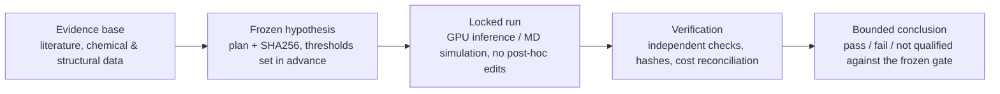

# cryo-discovery

A pre-registered computational discovery pipeline for cryopreservation research: evidence base → frozen hypothesis → locked run → verified, bounded conclusion. Built end to end in about three days (2026-09-05 to 2026-09-07) by directing AI coding agents, on under $10 of GPU spend. This is a research and engineering artifact, not a validated discovery or an efficacy claim.

## How it works

Every experiment in this repo follows the same discipline: state a hypothesis and its pass/fail thresholds before running anything, freeze the plan (hashed, committed), execute the run without changing the plan, then verify the result against the frozen gate and report it — pass, fail, or not qualified — without moving the goalposts afterward.



## What I decided vs. what agents built

**Decided (Chase):**
- The research question and scope: an evidence-linked cryopreservation resource separating physical ice protection, biological stress protection, and protocol effects, with cell-specific preservation benchmarks rather than a claimed universal optimum.
- Evidence standards: pre-registered plans with frozen thresholds, SHA256-hashed provenance, and independent verification before any result is reported.
- Which tracks to pursue or stop: moved from a baseline IRI (ice-recrystallization-inhibition) model to an advanced IRI ensemble, then pivoted to a ROCK2/Boltz-2 structural-affinity track after the IRI ensemble missed a known strong inhibitor (2FA).
- The pre-registered pass/fail thresholds for each benchmark (e.g. ≥20% MAE improvement and Spearman ≥0.5 for ROCK2 transfer gates; MAE ≤0.5 pIC50 and absolute bias ≤0.25 pIC50 for calibration gates).
- The $10 cumulative GPU spend cap and the per-run spend guards enforced before every Pod launch.
- The call to record the radiometric-assay calibration miss (absolute bias short by 0.013 pIC50) as an unqualified joint gate, rather than relaxing the threshold to pass it.

**Built (AI agents, Claude/Codex):**
- All code: literature acquisition and screening scripts, IRI and hydration-MD pipelines, Boltz-2 inference and RunPod orchestration, budget/lifecycle watchdogs.
- Data acquisition and curation: 40+ papers screened, evidence extraction, coverage and evidence tables.
- Simulations and GPU runs: hydration molecular-dynamics trajectories, the reference-cell transport model, and three ROCK2 Boltz-2 affinity panels (43, 30 and 50 compounds) under a fixed two-seed protocol.
- Report drafting: the phase-by-phase findings, verification logs, and the compiled PDF report.
- Tests: provenance and physics-consistency checks, budget and lifecycle safeguards, regression tests for every frozen pipeline.

## Results

All ROCK2 evaluations below are retrospective on compounds from published assays that may overlap Boltz-2's pretraining data — none of this is a test on unseen compounds, and none of it is a novelty, cryoprotection, or efficacy claim. Bootstrap intervals are descriptive, not formal confidence intervals for external generalization.

| Evaluation | n | Result | Verdict |
| --- | ---: | --- | --- |
| ROCK2 in-series benchmark ([report](reports/rock2-panel-benchmark.md)) | 43 | MAE 0.439 vs. 0.683 baseline (35.8% better), Spearman 0.744 | Transfer gate **passed** (retrospective, in-series). Scaffold-bootstrap improvement interval is 6.4%–43.2%, which includes values below the 20% gate. |
| Separate-publication assay ([report](reports/rock2-external-calibration.md)) | 30 | Worse than baseline (MAE 0.834 vs. 0.586, −42.2%), Spearman 0.448 | Transfer gate **failed** |
| Independent radiometric assay ([report](reports/rock2-radiometric-validation.md)) | 50 | Raw MAE 0.442 vs. 0.864 baseline (48.8% better), Spearman 0.864 | Transfer gate **passed**; held-out calibration gate **failed** — absolute bias missed its ≤0.25 pIC50 limit by 0.013; joint gate **not qualified** |
| Transport virtual experiment ([report](reports/discovery-pipeline.md)) | — | Staged CPA-loading hypothesis met its frozen improvement criteria | **Passed** in a published reference-cell (human oocyte) transport model — a model-level result, not a survival finding |

## What didn't work

- The IRI (ice-recrystallization-inhibition) models don't reliably beat a simple baseline on unseen scaffolds, and the advanced ensemble misses a known strong inhibitor: 2FA is observed at 3.0% MGS in the published assay, and the ensemble predicts roughly 72% MGS with its scaffold withheld. See [advanced-iri.md](reports/advanced-iri.md).
- The external, separate-publication ROCK2 transfer evaluation failed its frozen gate (Spearman 0.448, worse-than-baseline MAE). See [rock2-external-calibration.md](reports/rock2-external-calibration.md).
- The radiometric-assay calibration gate missed its bias threshold by 0.013 pIC50. That miss was recorded as a failure and the joint gate left unqualified — the threshold was not moved to make it pass. See [rock2-radiometric-validation.md](reports/rock2-radiometric-validation.md).

## Discipline

- Every experiment is frozen before execution: a written plan, hashed (SHA256), committed to version control, with pass/fail thresholds fixed in advance.
- Re-runs of a completed, frozen plan are refused by the tooling itself (`discovery_pipeline.py` refuses to repeat a run ID; the Boltz inference scripts refuse to reuse an existing seed output directory).
- Failed attempts are preserved, not deleted: failed GPU launches, provider setup failures, and rejected retries all remain in the cost and verification records rather than being cleaned out of the history.
- Spend guards: a $10 cumulative GPU budget was enforced before every launch, with per-phase and running-total cost reconciliation recorded in [verification.md](reports/verification.md). Total estimated GPU spend across the project was about $6.76.

## Reproduce

Original research files and downloads use a local `<local-storage>/cryo-adata/` directory outside the repo; see [research storage setup and commands](docs/storage.md).

The literature-report commands below require Python 3.10+ and its standard library only.

```sh
python3 scripts/validate_pilot.py
python3 scripts/build_backlog.py
python3 scripts/build_phase4_status.py
python3 -m unittest discover -s tests
```

With locally archived sources also present:

```sh
python3 scripts/audit_sources.py
```

Raw source XML/HTML is excluded from Git because redistribution rights vary. The committed source audit records the original local check; on a fresh clone, `fetch_sources.py` can reacquire metadata and available XML, while HTML sources need separate retrieval. See [tooling](docs/tooling.md) and the [access setup](docs/access-setup.md).

The optional IRI/MD/Boltz-2 tracks use separate pinned scientific environments; see each report's reproduction section, starting with [reports/iri-benchmark.md](reports/iri-benchmark.md#reproduction-and-checks).

## Next step

A calibration-transfer test on a broader, independent set of scaffolds is pre-specified but not yet run: the panel is frozen (see [rock2-orthogonal-assay-review.md](reports/rock2-orthogonal-assay-review.md) and the phase 17 external-benchmark candidate inventory), pending a new frozen plan and fresh GPU budget reconciliation before execution.

## Full report

[Complete Cryo research report (PDF)](output/pdf/cryo-research-report.pdf) — the compiled, cited synthesis of every track below. [Editable source](reports/cryo-research-report.md).

## Reports index

### Literature & shortlist

- [Phase 5 findings: ranked shortlist and experimental handoff](reports/phase5-findings.md)
- [Six ranked research candidates](data/phase5/ranked-shortlist.json) and [four-arm experiment matrix](data/phase5/experiment-matrix.json)
- [Published combination means: benefit versus interaction analysis](data/phase5/combination-analysis.json)
- [Phase 4 findings: seven priority studies, mechanisms and validation handoff](reports/phase4-findings.md)
- [Phase 3 findings, original cardiomyocyte data and research priorities](reports/phase3-findings.md)
- [Phase 2 findings and iPSC original-data analysis](reports/phase2-findings.md)
- [Initial pilot synthesis](reports/research-synthesis.md)
- [Data acquisition, analysis and experimental validation plan](docs/research-plan.md)
- [Curated dataset: 40 papers, 75 experiment summaries](data/pilot-studies.json)
- [Evidence table](reports/evidence-table.md) and [coverage](reports/coverage.json)
- [Nine PubChem reference-compound identities](data/reference-compounds.json)
- [Literature backlog: 194 title-screened records](data/phase2/backlog-screening.json)
- [79 abstract screens and review provenance](data/phase3/abstract-screening.json)
- [57 remaining full-text candidates and partial-access status](data/phase5/fulltext-queue.json)
- [Four testable research priorities and required controls](data/phase4/hypothesis-portfolio.json)
- [Preservation-condition benchmark: 3 studies, 10 conditions](data/phase3/protocol-benchmarks.json)
- [Original cardiomyocyte observations and descriptive analysis](data/phase3/cm-2025-analysis.json)
- [Original iPSC measurements and expression-list analysis](data/phase2/iri-2024-analysis.json)
- [Source audit](reports/source-audit.json) and [source-file hashes](data/source-manifest.json)

### IRI models

- [IRI data reconciliation and independent-data acquisition](reports/iri-data-reconciliation.md)
- [Advanced IRI models: nested validation, ensemble and limitations](reports/advanced-iri.md)
- [First virtual IRI benchmark: results and candidate applicability](reports/iri-benchmark.md)
- [Virtual-experiment feasibility and laboratory requirements](reports/virtual-experiment-feasibility.md)

### Hydration MD

- [Same-formula virtual comparison: leucine versus isoleucine](reports/matched-hydration.md)
- [Longer hydration controls: 40 ns sampling follow-up](reports/hydration-extensions.md)
- [Histogram sampling calibration](reports/hydration-sampling-calibration.md)
- [Hydration measurement and ensemble stability](reports/hydration-stability.md)
- [Hydration descriptor definition and saved-trajectory audit](reports/hydration-definition.md)
- [Virtual hydration pilot, compute costs and external-source acquisition](reports/hydration-pilot.md)

### Discovery pipeline

- [Discovery pipeline: frozen hypotheses, virtual transport experiment and next evidence gates](reports/discovery-pipeline.md)
- [Transport experiment results](data/phase14/runs/transport-002/result.json) and [discovery track status](data/phase14/hypotheses.json)

### ROCK2 / Boltz-2

- [50-compound radiometric ROCK2 validation: strong ranking, calibration bias narrowly misses the gate](reports/rock2-radiometric-validation.md)
- [ROCK2 orthogonal-readout diagnostic and independent-validation readiness](reports/rock2-orthogonal-assay-review.md)
- [Separate ROCK2 assay evaluation and held-out calibration: screening criteria not met](reports/rock2-external-calibration.md)
- [43-compound ROCK2 benchmark: two-seed predictions, baseline comparison and limitations](reports/rock2-panel-benchmark.md)
- [Boltz-2 GPU reference pilot: predictions, limits and compute accounting](reports/boltz-pilot.md)
- [Biological-target benchmark, permeability/toxicity data and Boltz readiness](reports/biological-benchmark.md)

### Verification

- [Verification across phases](reports/verification.md)
- [Cost and provenance reconciliation](docs/api-access.md), [access setup](docs/access-setup.md)
