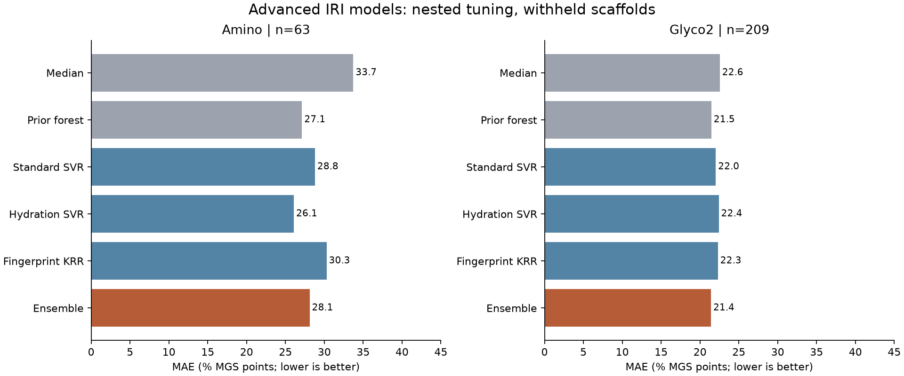

# Advanced molecular IRI models

We built and evaluated a more advanced model pipeline: nonlinear models on published molecular and hydration descriptors, a structural-fingerprint kernel model, and a fixed ensemble. **The added complexity does not yet provide a dependable improvement on unseen chemical scaffolds.** The models are reusable research artifacts; they are not validated predictors of new cryoprotectant efficacy.

## What was built

| Component | Molecular information | Training |
| --- | --- | --- |
| Standard SVR | 45 published graph, physicochemical and conformer-sensitive descriptors | Nonlinear support-vector regression |
| Hydration SVR | Standard45 plus 100 hydration-histogram bins and 10 hydration indices | Nonlinear support-vector regression |
| Fingerprint KRR | Chiral Morgan fingerprints, radius 2, 2,048 bits | Tanimoto-similarity kernel ridge regression |
| Ensemble | Predictions from all three components | Fixed equal weights |

The hydration features summarize simulations performed by the original researchers. We reused those published summaries; we did not run new molecular dynamics trajectories. This is not a reproduction of the paper's complete neural ensemble. [DOLMEN source and descriptor documentation](https://github.com/gcsosso/DOLMEN/tree/10ed726bed8158544222b5f16298a54013b6ad62), [model plan](../data/phase8/model-plan.json).

The pipeline reuses the **exact Phase 7 outer folds** and the same two assay cohorts: 63 Amino compounds at nominal 20 mM in 10 mM NaCl, and 209 Glyco2 compounds explicitly at 22 mM in PBS. Inside each outer training fold, three-fold grouped validation selects hyperparameters. Imputation and scaling are fitted inside each inner training fold. The outer test outcomes never select parameters or ensemble weights. This follows the purpose of [nested cross-validation](https://scikit-learn.org/stable/auto_examples/model_selection/plot_nested_cross_validation_iris.html).

Because the Phase 7 outcomes were already inspected, these remain **development comparisons**, not an untouched final evaluation. The 17 Amino prediction records remain quarantined for concentration reconciliation and lack hydration descriptors. No additional independent test set was created by relabeling those records.

## Results on withheld scaffolds

Mean absolute error in reported % mean grain size (MGS) points; lower is better:

| Model | Amino, n=63 | Glyco2, n=209 |
| --- | ---: | ---: |
| Previous median baseline | 33.72 | 22.55 |
| Previous ridge baseline | 35.11 | 21.38 |
| Previous random forest | 27.13 | 21.47 |
| Standard SVR | 28.79 | 22.03 |
| Hydration SVR | 26.08 | 22.42 |
| Fingerprint KRR | 30.29 | 22.31 |
| Fixed ensemble | 28.11 | 21.41 |

The hydration model improves Amino average error modestly, while the ensemble worsens it relative to the earlier forest. For Glyco2, the ensemble nearly matches the earlier forest and does not beat the earlier ridge baseline. Its scaffold-test R² is approximately 0.016. Descriptive scaffold-bootstrap intervals for the ensemble's paired error difference versus the earlier forest include zero in both cohorts. Neither averaging nor additional features establishes reliable improvement here.

On the easier connectivity-held-out split, the Glyco2 ensemble error is 19.51 versus 20.46 for the earlier forest. Related scaffolds remain in training in that comparison, so it does not establish generalization to new chemical families. Equal-group error metrics and all tuning trials are retained alongside compound-weighted errors. [Full nested results](../data/phase8/advanced-results.json).



**2FA remains an important miss.** Its observed value is 3.0% MGS in the published 22 mM assay. With its scaffold withheld, the advanced ensemble predicts 71.63, versus 72.96 for the earlier forest. The new components predict 70.73 (standard), 67.69 (hydration), and 76.47 (fingerprints). None recovers the known strong inhibition. This diagnoses the models; it does not overturn the original experimental measurement. These numbers are ice-grain assay outcomes, not cell-survival percentages. [2FA diagnostic](../data/phase8/2fa-diagnostic.json).

## Data quality and applicability

Four additional descriptor files, totaling 243,063 bytes, were downloaded at the same pinned source commit. Hydration tables have fewer rows than the molecular datasets. We joined them by normalized compound name, rejected conflicting duplicate-name vectors and kept unresolved entries missing. No rows were shifted to fill gaps. With this policy, Glyco2 has complete histogram vectors for 190/209 compounds and complete hydration-index vectors for 188/209; all 63 Amino training compounds have both. Missing values are imputed within training folds, with missingness indicators. Coverage patterns could themselves influence performance. [Feature audit](../data/phase8/feature-audit.json), [source hashes](../data/phase8/source-manifest.json).

An independent Luna audit also found approximately one-proton mass differences between supplied SMILES and archived standard descriptors for 15/63 included Amino records. This is consistent with a molecular-state difference, but its exact cause remains unverified. We preserved the archived representation rather than selectively replacing one feature and mixing conventions. Shape and hydration descriptors also depend on conformer/protonation/simulation choices. This limits causal claims about the value of hydration features. [Descriptor review](../data/phase8/descriptor-review.json).

There is no prediction of CEPT recovery, 2FA-plus-CEPT synergy, toxicity or post-thaw cell function. Mixtures, polymers and proteins are outside this small-molecule IRI task. A larger neural network or a pretrained molecular model is technically possible, but these data do not establish that it would be more reliable.

## Recommended next work

Prioritize coherent chemical-series data and an independent evaluation set. Reconcile the structure/protonation and assay metadata, then reserve a source-separated or newly measured set before further model selection. Another representation or a pretrained encoder can be compared within that process. The current 2FA result is already a development diagnostic and cannot later be presented as an untouched test.

No broad candidate purchase or new-compound ranking is justified by the present scores. The useful milestone is now a working, auditable advanced-model pipeline plus a clear picture of its failure cases. New IRI labels can strengthen that pipeline; separate cell experiments will still be needed for the biological discovery objective.

## Reuse and verification

Use the existing Python 3.13 environment pinned by [requirements-iri.txt](../requirements-iri.txt):

```sh
python3 scripts/with_external_storage.py -- python3 scripts/fetch_iri_advanced.py
python3 scripts/with_external_storage.py -- .venv/bin/python scripts/advanced_iri.py
python3 scripts/with_external_storage.py -- .venv/bin/python -m unittest discover -s tests
```

Phase 7 source files/results are prerequisites; [the baseline report](iri-benchmark.md#reproduction-and-checks) provides their acquisition and generation commands. No additional packages, API keys, paid compute or laboratory service were needed.

After evaluation, the script separately tunes and fits each family on each full cohort and saves two local bundles under `data/raw/phase8/models/`. They contain the component estimators, training IDs and equal ensemble weights. These full-data fits are excluded from performance reporting. Bundle hashes and final parameter choices are in the results JSON; model files and original sources stay in ignored `cryo-adata/`. New inference with the full ensemble requires compatible standard/hydration feature vectors as well as fingerprints; SMILES alone do not generate its archived simulation features.

All 31 tests passed. New checks cover missing-row identity, duplicate-name quarantine, missing identifiers, kernel arithmetic, outer-label isolation through the actual tuning/evaluation path, and model serialization. Source hashes, unchanged outer folds, nested split separation and saved-model loading were checked. The result figure was visually inspected.
