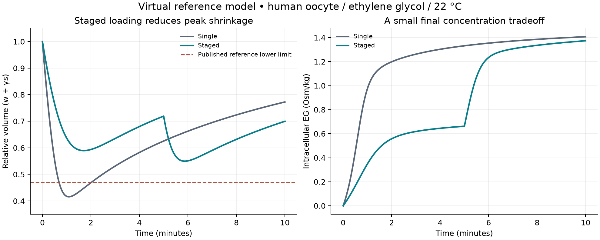

# Cryo discovery pipeline: first complete virtual experiment

2026-09-06 • Phase 14 • run `transport-002`

We built and ran the first unified hypothesis → frozen experiment → numerical verification → bounded conclusion workflow. A staged CPA-loading hypothesis passed in a published reference-cell transport model. This is a software and modeling milestone. It does **not** identify a new compound or establish improved post-thaw survival.

The result suggests a useful next question: which permeability measurements are necessary before a loading schedule can be transferred to our intended cells? The sensitivity results show why that calibration matters.

## What now works

- An evidence-linked [hypothesis registry](../data/phase14/hypotheses.json) records source hashes, model domain, controls, endpoints, acceptance criteria and novelty status.
- A [local runner](../scripts/discovery_pipeline.py) freezes a hypothesis and code fingerprints before execution, refuses repeated execution under an existing run ID, and preserves results and hashes.
- A [cell-transport adapter](../scripts/cell_transport.py) integrates water and CPA exchange separately, restarts at bath changes, refines volume extrema and reports intracellular CPA exposure.
- [Conclusion validation](../scripts/hypothesis_registry.py) requires the result to match its plan and restricts virtual results to model-level claims. These checks support review; they do not automatically establish scientific truth or detect every misleading sentence.
- Existing literature, IRI models, hydration simulations and the [laboratory matrix](../data/phase5/experiment-matrix.json) remain upstream evidence and future validation inputs. They are not automatically merged into a whole-cell predictor.

The new runner currently executes **one adapter type: the paired transport comparison**. Literature screening, candidate nomination, biological-target selection, laboratory execution and novelty review still require separate work. A fully autonomous end-to-end discovery system is not finished.

## The frozen question and its result

The virtual comparison holds total duration and final bath composition constant. Both baths contain normalized nonpermeating concentration m1=1. The baseline uses normalized EG m2=5 for 10 minutes; the staged scenario uses m2=2.5 for 5 minutes then m2=5 for 5 minutes. Multiplying m2 by 0.3 converts to Osm/kg, **not molarity**. These are analyst-designed simulation scenarios, not an experimental recommendation.

Before execution, we required a minimum-volume improvement of at least 0.05 and final intracellular EG molality at least 95% of baseline. The code, sources and [plan](../data/phase14/runs/transport-002/plan.json) were committed in `7d1360a` before this run. Plan SHA256: `9a615f4317192e53fb84afd910a028492706ec0bad44c7e8cee9155eb2bf4f6d`. This is a local versioned freeze, not an independent public preregistration.

| Endpoint | Single step | Staged |
| --- | ---: | ---: |
| Minimum relative volume | 0.415856 | 0.549707 |
| Final relative volume | 0.772624 | 0.699877 |
| Final intracellular EG, Osm/kg | 1.407138 | 1.373754 |
| Intracellular EG exposure, Osm·min/kg | 12.306377 | 8.863752 |

The minimum-volume improvement was **0.1339**, with **97.63%** of baseline final intracellular concentration retained. The frozen comparison therefore passed. The final volumes differ; matching concentration does not mean matching total intracellular CPA amount. Neither schedule is claimed to reach vitrification conditions.



The staged run remained above the source's reference lower volume limit of 0.47; baseline fell below it. That observation is descriptive and was not the frozen decision criterion. Crossing a model limit does not itself measure cell death, and staying inside it does not demonstrate survival.

## Equations, parameters and checks

The implementation uses the isothermal two-parameter model from [Davidson, Benson and Higgins (2014)](https://pmc.ncbi.nlm.nih.gov/articles/PMC3994563/), Eq. 1 and Appendix A. Its reference domain is human oocytes exposed to EG at 22 °C. Source-derived parameters and locators are in [transport-reference.json](../data/phase14/transport-reference.json).

`dw/dτ = −m1 − m2 + (1+s)/w`, `ds/dτ = b(m2 − s/w)`.

Here w is normalized water volume, s is normalized intracellular CPA amount, b=1.62, dimensional minutes=4.33τ, and the source-defined relative volume is w+0.0168s. Bath steps are held constant during each integration segment. The independent reference changes variables using dτ=w dx and solves the resulting linear system by an augmented matrix exponential, then inverts τ(x).

- Maximum difference against that reference: **1.91e-11** in normalized state units; frozen tolerance 1e-7.
- Maximum endpoint difference after tighter solver tolerances and denser sampling: **1.28e-10**; frozen tolerance 1e-6 in each metric's own units.
- Seventeen tests cover equilibrium, water-only behavior, bath-switch continuity, partition invariance, nonphysical inputs, nondefault initial state, provenance tampering, failed-run retention and unsupported claims.

Agreement between mathematical implementations establishes numerical consistency. No independent volume-time measurements were fitted or validated here. The exposure integral is a concentration-time summary, with no fitted relationship to toxicity. The model omits cooling, ice formation, biological signaling and survival.

## Sensitivity and the next hypothesis

We changed relative permeability b by factors 0.5, 1 and 2 and the dimensional time scale by factors 0.75, 1 and 1.25. These are assumed scenarios, not estimated uncertainty distributions. All 9/9 met the paired comparison criteria. **3/9 staged scenarios nevertheless crossed below the published 0.47 reference volume limit**, all at half the reference relative permeability.

| b multiplier | Time-scale multiplier | Staged minimum volume | Final concentration / baseline | Frozen comparison |
| ---: | ---: | ---: | ---: | --- |
| 0.5 | 0.75 | 0.4637 | 0.9659 | Pass |
| 0.5 | 1 | 0.4311 | 0.9614 | Pass |
| 0.5 | 1.25 | 0.4076 | 0.9575 | Pass |
| 1 | 0.75 | 0.5836 | 0.9789 | Pass |
| 1 | 1 | 0.5497 | 0.9763 | Pass |
| 1 | 1.25 | 0.5244 | 0.9741 | Pass |
| 2 | 0.75 | 0.7026 | 0.9886 | Pass |
| 2 | 1 | 0.6791 | 0.9871 | Pass |
| 2 | 1.25 | 0.6565 | 0.9861 | Pass |

The supported statement is limited: staging improves this model's shrinkage/loading tradeoff over the tested scenarios. A useful follow-on hypothesis is that a schedule constrained by **absolute** volume limits can retain adequate loading at lower CPA permeability. That follow-on needs a new frozen design, explicit concentration target and independent validation; it is not tested by the current comparison. For our intended iPSC work, the first requirement is cell/CPA-specific transport data rather than assuming oocyte parameters transfer.

## Other discovery tracks

| Track | Current capability | Next evidence gate |
| --- | --- | --- |
| Evidence and candidate identification | Existing 40-paper corpus, protocol tables, six-candidate shortlist | Extract comparable compound-specific permeability, ice behavior and recovery outcomes with negative controls |
| Cell transport | Executable reference model and bounded conclusion | Independent target-cell volume-time data, calibration and held-out protocol check |
| Ice interface | Primary methods and supplement archived; setup audited | Recover or reconstruct slab, topology, force-field and analysis inputs, then qualify polymer-free and known-polymer controls |
| Biological target | Mechanistic literature and biological recovery references | Select target and assay; benchmark ligand/structure predictions against measured controls |
| Experimental response | Four-arm physical/biological combination design | Real independent viability and function measurements; subsequent controlled analysis |
| Novelty | Claim status recorded separately | Focused prior-art search for a precise finding, independent evidence and replication |

The [ice-interface audit](../data/phase14/ice-source-review.json) found a reported approximately 90,818-atom, 200-ns-per-trajectory benchmark in [Bachtiger et al. (2021)](https://www.nature.com/articles/s41467-021-21717-z). The inspected public record provided article material but no ready-to-run coordinate/topology/analysis bundle. A reconstruction can be pursued, but it must be labeled method development until controls qualify it. Runtime and dollar cost cannot be inferred reliably from the paper. Existing liquid-water hydration trajectories do not replace an ice-front experiment.

AlphaFold or Schrödinger could support a selected protein-target track. Neither currently supplies the missing mapping from predicted molecular behavior to post-thaw cell function. No new license, API or paid service was required for this phase.

## Reproduction and audit

Use the existing `.venv`, or a Python 3.13 environment with `requirements-transport.txt`. Raw source files remain under the ignored local `cryo-adata/` storage; restore/download the archived sources using the storage wrapper and URLs in the source reviews on a fresh clone. Verification requires their recorded hashes and the current code to match the frozen versions. Later code changes require checking out the corresponding historical implementation to verify an older run.

```sh
.venv/bin/python -m unittest tests.test_cell_transport tests.test_hypothesis_registry tests.test_discovery_pipeline
.venv/bin/python scripts/discovery_pipeline.py status
.venv/bin/python scripts/discovery_pipeline.py verify transport-002
.venv/bin/python scripts/report_discovery_pipeline.py
```

To perform another experiment, add a reviewed hypothesis/design to the registry, choose it with `--hypothesis`, and use a new run ID. `freeze` writes the plan; `run` checks sources and code before computing. Repeating `run transport-002` is deliberately refused. No run artifacts should be deleted to force a retry. `transport-001` was superseded before execution after a provenance review; its original plan is preserved.

```sh
.venv/bin/python scripts/discovery_pipeline.py freeze transport-new --hypothesis transport-staged-eg-reference
.venv/bin/python scripts/discovery_pipeline.py run transport-new
.venv/bin/python scripts/discovery_pipeline.py verify transport-new
```

[Machine-readable results](../data/phase14/runs/transport-002/result.json), [trajectories](../data/phase14/runs/transport-002/trajectories.json), and [manifest](../data/phase14/runs/transport-002/manifest.json) are versioned. Original downloads are excluded from Git. This phase incurred **$0 new GPU spending**; the existing $10 cumulative cap remains in force and previous charges must be reconciled before another rental.
