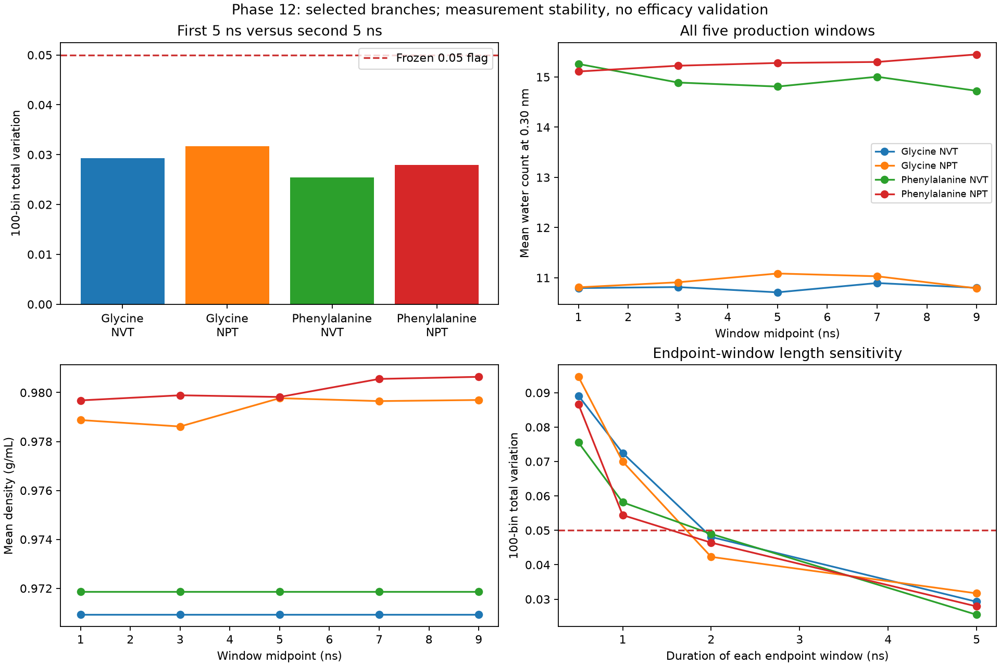

# Longer hydration sampling controls

Four selected 10-ns stochastic branches produced 40 ns of new liquid-water
sampling. **0 of 4 branches retain an engineering flag**
under the frozen first-versus-second 5-ns comparison. Each branch retained its
parent's final coordinates and velocities, reset thermostat/barostat RNG seeds,
and excluded 100 ps of re-equilibration. The original 3-ns segments were not pooled.

| Parent / branch | 100-bin TV | Count change (water) | Density change (g/mL) | Mean T (K) | Flags |
| --- | --- | --- | --- | --- | --- |
| gly-NVT-20260917 | 0.0293 | +0.050 | +0.00000 | 273.13 | None |
| gly-NPT-20260917 | 0.0317 | +0.090 | +0.00045 | 273.44 | None |
| phe-NVT-20260916 | 0.0255 | -0.104 | +0.00000 | 273.21 | None |
| phe-NPT-20260916 | 0.0279 | +0.194 | +0.00034 | 273.43 | None |

The unchanged primary limits are TV > 0.05, absolute water-count change > 0.5
at 0.30 nm, absolute density change > 0.005 g/mL, and absolute whole-production
mean temperature offset > 3 K from 273 K. NVT density is structurally constant.
Every 2-ns window and the complete block/resolution/length diagnostic grid are
saved in `data/phase12/extension-results.json`; no maximum-window gate was added.

The parents were selected after inspecting Phase 11. These four branches are
not independent starting conformations or validation replicates. Block-mixing
tail fractions are descriptive references, not p-values; exchangeability and
dependence scales remain unvalidated. Coarsening cannot increase TV.

Passing supports only measurement stability for this descriptor and setup.
It does not establish physical convergence, reproduce unresolved DOLMEN settings,
or predict cryoprotective efficacy. No ice, cell membrane, apoptosis, toxicity,
or post-thaw function is modeled. No experimental labels or models were added.

OpenMM XML states preserve physical state but not the internal RNG state, so
these are explicitly stochastic branches with recorded new seeds.
See [OpenMM Simulation documentation](https://docs.openmm.org/latest/api-python/generated/openmm.app.simulation.Simulation.html).

Within these same new trajectories, the secondary first-versus-last 1-ns comparisons remain above 0.05 (range 0.0544–0.0725). The longer 5-ns comparisons pass without changing histogram resolution. This supports sensitivity to sampling duration; it does not prove equilibrium. All four primary contrasts fall within the descriptive 5th–95th percentile mixing envelopes at each of the 100/250/500-ps block scales.

For the selected NPT versus NVT pairs, whole-production water counts at 0.30 nm differ by +0.122 for glycine and +0.335 for phenylalanine; density differs by approximately +0.0084 and +0.0083 g/mL respectively. These are single selected parent pairs, so no replicate uncertainty or efficacy inference is assigned.

The next virtual step is the already deferred leucine/isoleucine control comparison, which reduces molecular-size differences. It still requires a new frozen design and budget check. Experimental ice-recrystallization and cell-recovery measurements remain necessary for efficacy validation.

Estimated cumulative GPU spending through Phase 12 is **$2.0101** against the $10 authorization. Research Pod deletion confirmed: **True**. Elapsed-time estimates are separate from posted provider billing, which may be incomplete and include storage. See `data/phase12/compute-costs.json`.

The first four-Pod attempt stopped before production when an overly strict restored-state comparison rejected GPU rounding. It cost approximately $0.0820 and is included above. The successful retry retained the frozen scientific plan and recorded restoration errors below 4.12e-7 nm for positions and zero for velocities. Failed-run archives, receipts and source are preserved in `data/phase12/retry-rationale.json` and Git.

Reproduce from locally archived results with `python3 scripts/with_external_storage.py -- env MPLCONFIGDIR=data/tmp/matplotlib .venv/bin/python scripts/analyze_hydration_extensions.py`. The frozen plan, source hashes, branch-parent hashes and raw trajectory checksums are preserved in `data/phase12/`.
