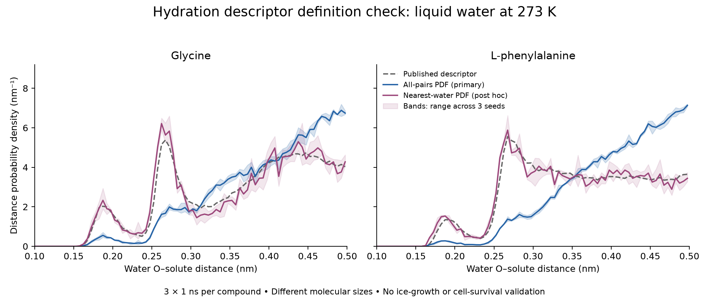

# Virtual hydration pilot and external-data acquisition

Completed six molecular-dynamics trajectories: two known activity-range
controls, three independent starting seeds each, and 1 ns of production per
seed. Both rented Pods were deleted; estimated GPU charges total **$0.22**.
The pilot exposes an important descriptor-definition ambiguity to resolve
before scaling. It does not validate a new cryoprotectant or add independent
experimental measurements.

## What the simulation measures

The controls are L-phenylalanine and glycine, with published Amino assay values
of 11.8% and 97.7% mean grain size respectively; lower values indicate stronger
ice recrystallization inhibition. They share the nominal experimental condition
but differ substantially in molecular size. Their labels were known when the
controls were selected, so this is a feasibility comparison rather than a new
prediction test. [Original study](https://doi.org/10.1038/s41467-024-52266-w).

Each model contains one explicitly zwitterionic free amino acid in a 4 nm cube
of liquid TIP4P/Ice water, with CHARMM36 solute parameters at 273 K. After
100 ps equilibration, the workflow records 100 frames over 1 ns. It counts
nearby water molecules and builds an all-pairs water–solute distance histogram
based on the source study’s prose; the exact production definition is unresolved. It also reports counts divided by molecular weight; that is
not the source model's volume-normalized descriptor.

This system contains no ice interface, membrane, cell, apoptosis machinery or
drug-target binding model. It measures hydration under chosen physical
assumptions, not ice growth, toxicity or post-thaw survival. Original molecular
states and complete MD inputs were not recovered from the inspected source
repositories. These are reconstructed simulations, not a faithful reproduction
of the published 20 ns runs. [Methods and exact settings](../simulation/README.md),
[prespecified design](../data/phase10/simulation-plan.json).

## Results and descriptor-definition check

All six runs produced finite coordinates and energies. Mean sampled
temperatures ranged from 272.53 to 273.54 K. Fixed-volume densities were
0.9709–0.9719 g/mL; no pressure equilibration was performed. GPU production
throughput was approximately 963–967 ns/day for these small systems, excluding
setup and installation.

| Control | Waters within 0.30 nm, mean ± SD across three seeds |
| --- | ---: |
| Glycine | 10.97 ± 0.19 |
| L-phenylalanine | 15.19 ± 0.18 |

The SD is variation between simulation seeds under one chosen physical model,
not uncertainty over molecular states, force fields, or experimental efficacy.
Counts also depend on molecular size; the difference does not establish why
one compound is more IRI-active. First-to-last time-block changes reached
approximately 1.8 water molecules at some cutoffs, so the short runs cannot
establish convergence.

The prespecified all-pairs probability histogram follows a literal reading of
the main article's distance definition, but differs appreciably from the
archived DOLMEN descriptors. We then investigated three alternative definitions
using the same saved trajectories. This investigation was **post hoc** and did
not change the simulations, fit models, or replace experimental labels.

| Histogram definition | Glycine distance from source | Phenylalanine distance from source |
| --- | ---: | ---: |
| All-pairs PDF — primary | 0.178 | 0.276 |
| Nearest-solute distance per water PDF — post hoc | 0.055 | 0.040 |
| All-pairs with radial weighting and PDF renormalization — post hoc | 0.104 | 0.140 |
| Nearest-water with radial weighting and PDF renormalization — post hoc | 0.278 | 0.223 |

These are total-variation distances between normalized histograms: zero means
identical distributions and one means no overlapping probability mass. They
are not activity prediction errors. Radial variants divide binned counts by
distance squared and then renormalize; they are shape diagnostics, not the
original dimensionless HIN pair-correlation output.

The nearest-water PDF is closer to the source for both controls. Public HIN
code contains both all-pair and nearest-distance modes, along with separate
radial normalization and hydration-count routines. However, the inspected
example uses a different mode and does not identify the production settings
that generated DOLMEN. Better visual agreement therefore supports further
definition/provenance checks; it does not prove which settings were used or
establish an exact reproduction. [Pinned source-code review](../data/phase10/histogram-definition-review.json),
[all numerical results and provenance](../data/phase10/hydration-results.json).

## Compute and verification

An isolated environment preserves the existing model-fitting environment. A
local CPU run reached its time guard before producing a complete result. The
Mac's OpenCL platform completed the 2 ps smoke test in single precision, with
production throughput around 75 ns/day. That very short timing is a feasibility
measurement, not a reliable forecast of every longer simulation.

The first RunPod attempt failed because its installed CUDA compiler generated
PTX newer than the host driver supported. It was deleted without producing a
trajectory, with approximately $0.06 in estimated GPU charges. The corrected
environment pins CUDA components to version 12.4 and explicitly verifies CUDA
force computation before production. [Failed-attempt receipt](../data/phase10/runpod-attempt1-receipt.json),
[local compute record](../data/phase10/local-compute.json).

The accepted GPU rate is $0.74/hour. Each attempted Pod has a 90-minute deletion
deadline, with independent local and remote watchdogs. The result collection
step also deletes the Pod and checks that it is gone. These safeguards apply
only to this research job. They are not a provider-enforced account spending
cap, and elapsed-time estimates are distinct from final billing.

The completed attempt used about 12.8 minutes of rented time, including setup
and retrieval. Together with the failed attempt, GPU estimates total
$0.2182. The billing API had not yet returned itemized records when checked;
this is not a final invoice. Both pilot Pod IDs were absent from a subsequent
account inventory. [Completed-run receipt](../data/phase10/runpod-receipt.json),
[cost and deletion checks](../data/phase10/compute-costs.json).

All 44 tests passed across the two environments: 35 existing research tests,
five MD invariants and four Pod lifecycle/budget tests. Root visually checked
the plot and verified source, trajectory, model and script hashes.

## Additional experimental-source material

The public ACS presentation supplement was acquired and checksum-verified:
61,841,604 bytes, four slides, four MP4 videos and four preview images. Slide
labels cover glycerol at 1 mM, antifreeze protein III with/without buffer, and
PVA. The archive has no embedded workbook. Root inspected its slide XML and
one preview image; the videos were not analyzed or digitized. These assets may
support future image-method development, but they do not supply a compatible
numeric table for the frozen model. [Official source](https://acs.figshare.com/articles/presentation/Do_Inhibition_Studies_of_Ice_Crystallization_Indicate_Cryoprotectant_Efficacy_/29185194),
[archive inventory](../data/phase10/acs-presentation-inventory.json).

The 2026 ionic-liquid study's public DOCX supplement was also acquired. Root
checked its text and object relationships: its tables concern surface tension,
literature comparisons and DSC; embedded objects concern chemical drawings,
spectroscopy and nucleation. Their internal numbers were not decoded. Repeated
literature IRI values cannot be counted as new independent observations.
[Supplement](https://ars.els-cdn.com/content/image/1-s2.0-S0021979726001980-mmc1.docx),
[acquisition log](../data/phase10/external-acquisition.json).

**Zero eligible independent experimental rows were added.** The existing fitted
models remain unchanged, and simulated observations have not been relabeled as
experimental outcomes.

## What would justify the next simulation stage

Longer trajectories should follow a review of density equilibration, molecular
states and agreement with the published descriptors. Fixed-volume water density
in this pilot is a modeling assumption; trajectory stability alone does not
establish that it is physically appropriate. Additional matched molecular
controls would help distinguish molecular-size effects from other hydration
differences. The original study's 20 ns duration is a comparison target, not an
automatic convergence guarantee.

This work can narrow computational questions without requiring a new lab
experiment. Establishing improved cell protection still requires independent
experimental measurements, either obtained from suitable existing studies or
generated in a laboratory.

Reproduction commands are in the [simulation guide](../simulation/README.md).
Raw sources, trajectories, environments and cloud logs remain in ignored local
`cryo-adata/` storage. No new molecule, improved biological efficacy or validated
general-purpose cryoprotection model is claimed.
