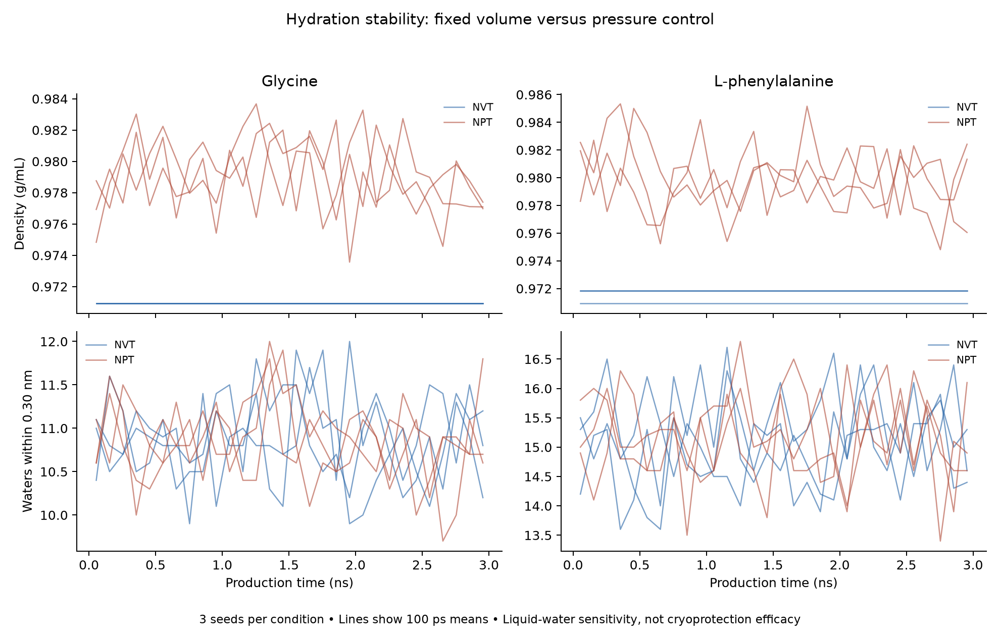

# Hydration measurement and ensemble stability

Completed 12 trajectories totaling 36 ns of production, plus 6 ns of equilibration. 12 runs triggered at least one prespecified stability flag. This is a liquid-water sensitivity study, not validation of ice inhibition or cell protection.

## Measurement and design

The new `cryo-nearest-water-v1` descriptor counts each nearby water once and measures its distance to the nearest solute atom, including solute hydrogens. Each frame has a conditional PDF over 0–0.5 nm, and frames are averaged with equal weight. All-pairs PDFs are retained as a secondary sensitivity measurement. The original DOLMEN production settings remain unresolved: this is an explicitly new representation, not a substitute input for the frozen source model. [Definition and saved-trajectory audit](hydration-definition.md).

Glycine and L-phenylalanine each have three seeds in fixed-volume NVT and pressure-controlled NPT. Every run starts in a 4 nm cube, equilibrates for 500 ps, and produces 300 frames over 3 ns. Both ensembles use 273 K, CHARMM36, TIP4P/Ice, assumed free-amino-acid zwitterions, and no added salt. NPT uses an isotropic Monte Carlo barostat targeting 1 bar, proposing volume changes every 25 steps. The thermostat controls temperature separately. [OpenMM barostat documentation](https://docs.openmm.org/latest/api-python/generated/openmm.openmm.MonteCarloBarostat.html).

Preparation seeds and durations match across ensembles, but trajectories diverge; this is not paired experimental replication. Changing volume changes density and effective solute concentration together. The source experimental assay uses 20 mM compound and 10 mM NaCl, so these simulations do not reproduce that solution. [Original study](https://doi.org/10.1038/s41467-024-52266-w), [plan frozen before production](../data/phase11/stability-plan.json).

## Results

Values below are means ± sample SD across three simulation seeds. They do not include uncertainty from force fields, molecular states or experimental assays.

| Compound | Ensemble | Density (g/mL) | Waters within 0.30 nm | Flagged runs |
| --- | --- | ---: | ---: | ---: |
| Glycine | NVT | 0.97092 ± 0.00000 | 10.876 ± 0.122 | 3/3 |
| Glycine | NPT | 0.97914 ± 0.00015 | 10.867 ± 0.095 | 3/3 |
| L-phenylalanine | NVT | 0.97155 ± 0.00054 | 15.094 ± 0.106 | 3/3 |
| L-phenylalanine | NPT | 0.97986 ± 0.00052 | 15.176 ± 0.080 | 3/3 |

The following differences subtract NVT from NPT within each preparation seed, then average across seeds. They describe the sensitivity of the entire modeled ensemble/volume setup; they do not isolate a causal density effect.

| Compound | Mean density change (g/mL) | Mean hydration-count change | Mean nearest-PDF TV |
| --- | ---: | ---: | ---: |
| Glycine | +0.00822 | -0.009 | 0.0418 |
| L-phenylalanine | +0.00832 | +0.081 | 0.0364 |

## Stability flags and decision

Before production we specified three 1 ns time blocks, flagging first-to-last changes above 0.005 g/mL in density, 0.5 water molecules at 0.30 nm, or 0.05 total variation in the nearest PDF; mean temperature must remain within 3 K of target. These are engineering thresholds, not statistical or physical convergence guarantees. All block means, per-seed ensemble contrasts, frame-stride sensitivity and exploratory autocorrelation estimates are preserved in the [numerical results](../data/phase11/stability-results.json). Autocorrelation estimates are finite-sample diagnostics, not confidence intervals.

| Run | Triggered flags |
| --- | --- |
| gly-NVT-20260916 | pdf_drift |
| gly-NPT-20260916 | pdf_drift |
| phe-NVT-20260916 | pdf_drift |
| phe-NPT-20260916 | pdf_drift |
| gly-NVT-20260917 | pdf_drift |
| gly-NPT-20260917 | pdf_drift |
| phe-NVT-20260917 | pdf_drift |
| phe-NPT-20260917 | pdf_drift |
| gly-NVT-20260918 | pdf_drift |
| gly-NPT-20260918 | pdf_drift |
| phe-NVT-20260918 | pdf_drift |
| phe-NPT-20260918 | pdf_drift |

All 12 flags concern the 100-bin PDF. No run crossed the prespecified density, 0.30 nm count or mean-temperature thresholds. The first-to-last PDF total variations range from 0.053 to 0.085. A threshold crossing does not by itself distinguish temporal change from finite histogram sampling.

A post hoc diagnostic found 10/12 chronological PDF differences within the 5th–95th percentile range obtained by randomly mixing 100 ps blocks from the same run. Runs above that range: phe-NVT-20260916, gly-NVT-20260917. This suggests finite sampling is relevant to the chosen 0.05 threshold, but does not establish stationarity: exchangeability and the block length remain assumptions. The tail fractions are not calibrated p-values. Coarsening cannot increase TV, so smaller 20-bin differences do not validate a new threshold. **All 12 original flags remain.** [Post hoc sampling diagnostics](../data/phase11/sampling-diagnostics.json).

Defer compound expansion pending review of stability flags and physical assumptions.

Do not scale directly to novel candidate screening. First assess whether additional trajectory duration resolves the observed flags and whether density/ensemble choices materially change descriptors. Three nanoseconds is longer than the pilot but shorter than the published 20 ns; neither duration automatically establishes convergence. Molecular size still differs between the two controls, and no new model was fitted.

A deferred leucine/isoleucine pair has the same molecular formula and verified free-amino-acid vacuum template builds. Its labels are already known and both show some IRI activity, so it is a method-development activity contrast, not an independent active/inactive test. No solvated simulations of these additional compounds were run. [Deferred controls](../data/phase11/deferred-controls.json).

## Compute, validation and limits

Estimated GPU charges are $0.835 for this phase and $1.054 across all research attempts, against the user's $10 cumulative limit. These elapsed-time estimates are not final invoices and exclude separately billed storage. All research Pods were confirmed absent. [Cost/deletion record](../data/phase11/compute-costs.json).
Provider records have posted $0.4569 in charges so far, potentially including storage. Phase 11 billed-time coverage is shorter than its recorded elapsed lifetime, so this partial total is not treated as the final cost.

The analyzer checks planned configurations, deployed input hashes, trajectory hashes, every saved frame for finite coordinates/observables, PDF normalization and density recomputed from mass and volume. It spot-checks count recalculation on the first, middle and last frame of every run; intermediate frames are covered by hashes and numerical checks but are not all independently remeasured. Raw trajectories, logs and environments remain in ignored local `cryo-adata/` storage.

The deployed source is preserved in Git commit `06210fc`, verified against every launch input hash. During review we found that the companion NPT PDB retained the initial box dimensions even though trajectory and final-state boxes were correct. The current runner fixes that metadata, and corrected `topology-final-box.pdb` copies accompany the preserved original cloud outputs. No trajectory, energy or hydration measurement was changed. [Deployment provenance](../data/phase11/deployment-provenance.json), [PDB correction record](../data/phase11/pdb-box-corrections.json).

**Zero independent experimental rows were added.** There is no ice interface, membrane, apoptosis target, cell-survival model or toxicity measurement. NPT specifies a pressure target, but we have not independently estimated mean pressure or calibrated the bulk-water model. A stable trajectory cannot validate a cryoprotectant. Prospective ice and post-thaw viability/function measurements remain necessary to establish a novel protective effect.

Reproduction commands and test results are in the [simulation guide](../simulation/README.md) and [verification record](verification.md).
