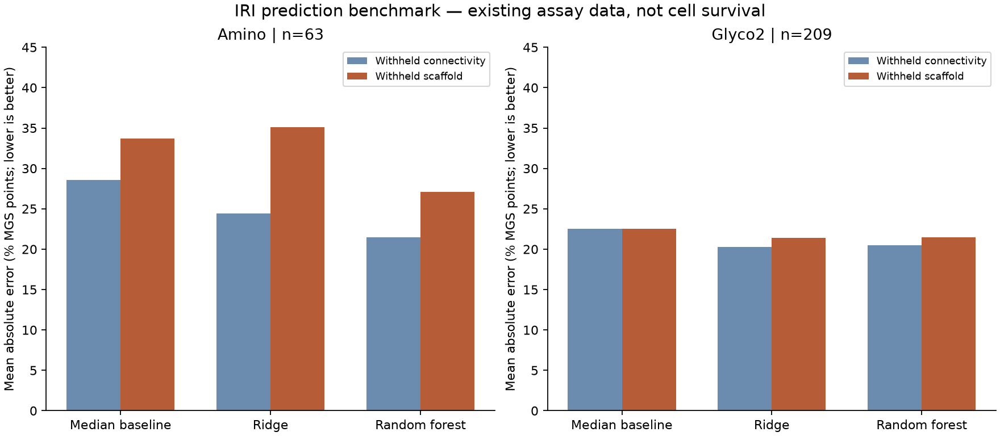

# First virtual IRI benchmark

Follow-up: the [data-reconciliation pass](iri-data-reconciliation.md) resolves the old prediction-set concentration mapping and reports it separately as a retrospective diagnostic. This report retains the original benchmark state.

The computational benchmark is complete. It evaluates three fixed baselines against existing experimental ice-recrystallization-inhibition (IRI) data. **The simple models are not yet reliable enough to rank new 2FA-like compounds.** This is an informative model-validation result, not a failed laboratory experiment or evidence against 2FA itself.

All computation ran locally with no paid API or GPU service. No molecular dynamics trajectories, whole-cell simulations or new biological measurements were generated. The curated literature corpus remains 40 papers and 75 experiment summaries; this benchmark is a separate derived dataset.

## Data and evaluation

The source is Warren et al., *Data-driven discovery of potent small molecule ice recrystallisation inhibitors*. The authors combined experimental IRI data and multiple representations, including molecular-simulation features, and tested selected predictions experimentally. This benchmark implements a simpler, independently written baseline on that task; it does **not** reproduce their complete ensemble or its published performance. [Primary paper](https://doi.org/10.1038/s41467-024-52266-w).

We acquired the public [DOLMEN data](https://github.com/gcsosso/DOLMEN/tree/10ed726bed8158544222b5f16298a54013b6ad62), pinned to commit `10ed726bed8158544222b5f16298a54013b6ad62`, including its license, dataset documentation and standard descriptors. Ten repository files total 213,800 bytes. Primary article XML and Figure 4 were also archived. All acquired inputs have SHA-256 records; original files remain local in ignored `cryo-adata/`. DOLMEN includes a GPL-3.0 license; its license and attribution are retained with the source snapshot. [Data manifest](../data/phase7/source-manifest.json), [primary-source manifest](../data/phase7/primary-source-manifest.json).

The target is reported **percent mean grain size (% MGS)** in a cell-free ice assay. Lower values mean stronger inhibition under that assay's conditions. These numbers are not cell-survival percentages.

| Cohort | Included | Condition policy |
| --- | ---: | --- |
| Amino | 63 training/test compounds | Nominal 20 mM in 10 mM NaCl |
| Glyco2 | 209 compounds | Only rows explicitly labelled 22 mM in PBS |

The Glyco file overlaps Glyco2 in all 124 canonical structures, so it was not added as independent training or testing data. Fourteen Glyco2 records at other or unreported concentrations were excluded. The included cohorts contain no duplicate canonical isomeric structures. Glyco2 does contain stereoisomers, which are held together during connectivity validation. Concentration matching does not eliminate all differences among literature sources. [Dataset audit](../data/phase7/dataset-audit.json).

The source's 17 Amino `predict` records were excluded from both training and cross-validation. The CSV labels all at 20 mM, while Figure 4 identifies three measurements made at 10 mM. Their number-to-structure mapping requires careful source reconciliation; this benchmark leaves all 17 quarantined and does not report a condition-matched external-test score. No source label was silently corrected.

Sixteen deterministic 2D RDKit descriptors were recomputed from the supplied structures. Archived upstream descriptors were not used: the initial baseline avoids ambiguous descriptor-row alignment and dependencies on 3D conformer generation. The models are a training-fold median, a scaled ridge regression and a fixed random forest. Scaling occurs within training folds, and neither labels nor experimental error bars enter the features. Hyperparameters and evaluation rules were fixed before inspecting model performance. [Benchmark plan](../data/phase7/benchmark-plan.json), [implementation](../scripts/benchmark_iri.py).

Primary validation withholds entire nonchiral Bemis–Murcko scaffolds in five folds. All acyclic compounds form one group. Secondary validation withholds molecular connectivity, keeping stereoisomers together while allowing related scaffolds in training. Both prevent exact canonical/connectivity overlap across train and test. Salts, charges and tautomers are preserved as supplied; this is not exhaustive chemical-family or source-study separation. There are only 11 Amino and 23 Glyco2 scaffold groups, with substantial size imbalance.

## Results

Mean absolute error on the primary, withheld-scaffold evaluation, in % MGS points:

| Cohort | Median baseline | Ridge | Random forest |
| --- | ---: | ---: | ---: |
| Amino | 33.72 | 35.11 | 27.13 |
| Glyco2 | 22.55 | 21.38 | 21.47 |

The forest improves the Amino average error, but scaffold-test R² is approximately −0.04. Glyco2 forest R² is approximately 0.004: the improvement is small. When each Glyco2 scaffold receives equal weight instead of each compound, forest error is **15.31**, versus **14.04** for the median baseline, reversing the apparent advantage. Group-bootstrap intervals for all scaffold-level model-versus-baseline comparisons include zero. These are descriptive intervals from fixed cross-validation errors, not independent confirmation or calibrated per-compound uncertainty.

With related chemistry allowed in training, forest errors fall to 21.45 for Amino and 20.46 for Glyco2. That easier evaluation should not be mistaken for performance on entirely new chemical families. All model/split metrics, fold memberships and out-of-fold predictions are retained, including unfavorable results. [Complete results](../data/phase7/benchmark-results.json).



## What this says about our candidates

**2FA is already in the public data**, with a reported 22 mM assay value of 3.0% MGS. It is not a newly discovered model hit. When its benzene scaffold group is withheld, ridge predicts 58.43 and the forest predicts 72.96; the median baseline predicts 64.70. Even the easier connectivity-held-out forest prediction is 56.36. These misses mean the present descriptors/models cannot reliably recover this known strong inhibitor.

Aryl gluconamides are represented in Glyco2, and structural neighbors are listed for transparency. Similarity alone is not a validated applicability threshold. No numeric prediction is issued for CEPT, EG/trehalose mixtures, the polymer, CAMP or CspB: cocktail, macromolecular and protein behavior is outside this small-molecule task. Individual CEPT molecules would require a separate identity/domain assessment; an IRI score would still say nothing directly about their biological recovery effect. [Candidate assessment](../data/phase7/candidate-applicability.json).

## Decision and next computational step

Do not use this baseline to buy or nominate new compounds on predicted efficacy alone. The next useful computational comparison is the published richer representations on the **same locked folds**, with a separate final test set reserved before selecting a model. Audit the 45 supplied descriptors and their row alignment first; subsequently evaluate hydration descriptors only where available. Preserve condition differences and the quarantined prediction records. Report every representation comparison rather than repeatedly tuning to the 2FA result.

The known 2FA miss is now a diagnostic, not an untouched test. Any model chosen after observing it needs independent evaluation. A new compound shortlist should wait until a model shows useful performance in its intended domain and uncertainty can be assessed. Small blinded IRI measurements would eventually provide stronger external validation; cell recovery and function still require distinct biological tests.

## Reproduction and checks

Use Python 3.13 and the pinned optional scientific environment:

```sh
python3 scripts/with_external_storage.py -- uv venv --python python3.13 .venv
python3 scripts/with_external_storage.py -- uv pip install --python .venv/bin/python --cache-dir data/tmp/uv-cache -r requirements-iri.txt
python3 scripts/with_external_storage.py -- python3 scripts/fetch_iri_benchmark.py
python3 scripts/with_external_storage.py -- .venv/bin/python scripts/benchmark_iri.py
python3 scripts/with_external_storage.py -- .venv/bin/python -m unittest discover -s tests
```

The result records source-manifest, plan and script hashes and package versions. A fresh retrieval changes the retrieval timestamp/manifest hash even when source bytes are identical. Tests cover source tampering, invalid structures, stereoisomer/acyclic grouping, held-out-label isolation and grouped error resampling. Tests for this optional environment skip when its dependencies are absent. The figure was visually checked; scientific limitations remain explicit above.
