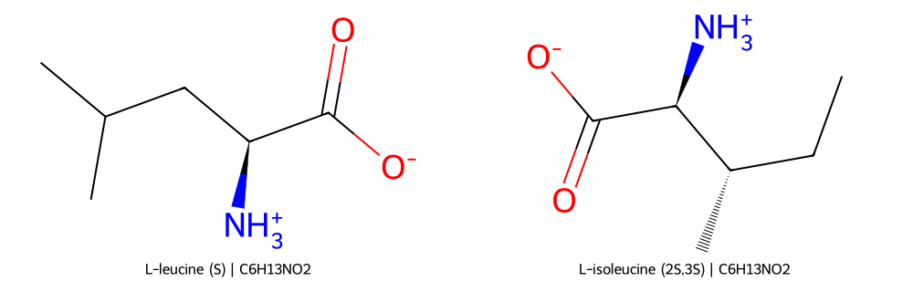
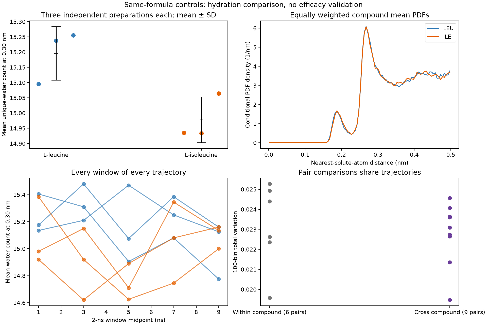

# Leucine versus isoleucine: a virtual same-formula comparison

Nearby-water counts separate the compounds in these three preparations each, but full distance-distribution differences overlap within-compound variation. This mixed result does not validate a prediction of cryoprotection.

Six independently prepared liquid-water simulations produced **60 ns** of new
sampling: three 10-ns trajectories per compound, each following 1 ns excluded
equilibration. **0 of six trajectories have an engineering stability flag.**
Both compounds have formula C6H13NO2 and modeled mass 131.175 Da, and each box
contains one zwitterion and exactly 2,070 water molecules. NPT simulations use
273 K, 1 bar, CHARMM36 and the same local TIP4P/Ice model as the prior phases.
Same formula controls mass and atom count, while shape, stereochemistry and
exposed surface remain different.

Mean water counts within 0.30 nm, expressed as mean ± sample SD across three
independent trajectories, are **15.196 ± 0.088
for leucine** and **14.978 ± 0.075 for isoleucine**.
Leucine minus isoleucine is **+0.218 water molecules**.
All nine cross-compound count differences have the same sign:
**True**. These overlapping pair
comparisons are descriptive; they are not nine independent observations.

The 100-bin TV between the equally weighted compound mean PDFs is
**0.0140**. Individual cross-compound
pair TVs range **0.0195–0.0246**, versus
**0.0196–0.0253** within compounds. Every cross-compound TV
exceeds every within-compound TV: **False**.
This compares observable separation with preparation-to-preparation variation;
it supplies no calibrated significance test or efficacy inference.

| Preparation | Mean water count at 0.30 nm | First/second 5-ns TV | Mean density (g/mL) | Mean concentration (mM) | Flags |
| --- | --- | --- | --- | --- | --- |
| leu-NPT-20261011 | 15.095 | 0.0325 | 0.97910 | 26.16 | None |
| leu-NPT-20261012 | 15.238 | 0.0269 | 0.97911 | 26.16 | None |
| leu-NPT-20261013 | 15.255 | 0.0262 | 0.97916 | 26.16 | None |
| ile-NPT-20261021 | 14.935 | 0.0242 | 0.97941 | 26.17 | None |
| ile-NPT-20261022 | 14.934 | 0.0280 | 0.97888 | 26.16 | None |
| ile-NPT-20261023 | 15.064 | 0.0291 | 0.97946 | 26.17 | None |

The descriptor counts unique water oxygens by their nearest distance to any
solute atom, including hydrogens. Its PDF is normalized within 0–0.5 nm for
each frame and then averaged equally across frames. It is not a radial
distribution function and has no radial-shell or exposed-area normalization.

The frozen stability checks retain TV > 0.05, absolute half-to-half count change
> 0.5 water, density change > 0.005 g/mL, and mean temperature offset > 3 K.
All five 2-ns windows and the full binning/block/length diagnostics are retained.
The replicate unit is the independently prepared trajectory, never a frame.
No endpoint, binning or seed was selected after examining production results.

The published context is a known activity contrast: leucine 45.6 ± 14.0 and
isoleucine 18.8 ± 4.1 percent mean grain size (reported SD), with lower values
indicating stronger cell-free ice-recrystallization inhibition. These values
were known during control selection and were not used for fitting or choosing
a direction of hydration effect. They are not new predictions or independent
validation. See the [original study](https://doi.org/10.1038/s41467-024-52266-w)
and the [source reconciliation](../data/phase11/deferred-controls.json).

The source assay uses nominally 20 mM compound, 10 mM NaCl, and ice annealing at
−8 °C. These simulations use salt-free liquid water at 273 K and report their
own realized concentration. They do not model an ice surface, recrystallization,
apoptosis, toxicity or cell recovery. Same-formula matching cannot establish a
causal cryoprotective mechanism. The original DOLMEN descriptor settings remain
unresolved; these are the explicitly defined local nearest-water descriptors.

The runs support a descriptive comparison of hydration under this setup. Demonstrating cryoprotection requires condition-matched ice-recrystallization and cell-recovery experiments. Broader virtual modeling should first use additional controls and independently validate the physical setup and observable.

Estimated cumulative GPU spending is **$4.0777** of the $10 authorization; all research Pods absent: **True**. Estimates include failed attempts; posted billing may be incomplete and include storage.

The frozen design, source and input hashes, all individual comparisons and uncertainty limitations are in `data/phase13/`. Reproduce with `python3 scripts/with_external_storage.py -- env MPLCONFIGDIR=data/tmp/matplotlib .venv/bin/python scripts/analyze_matched_hydration.py`.
