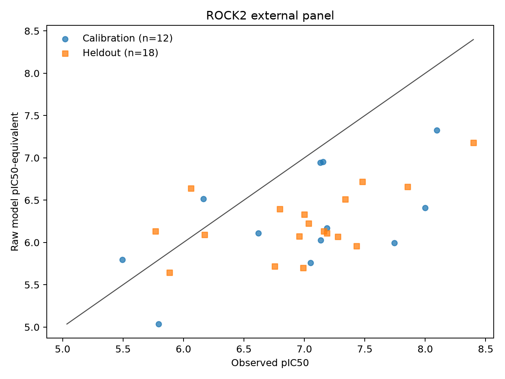
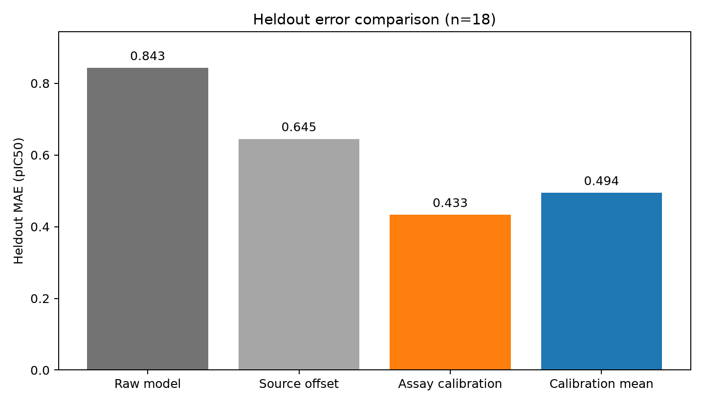
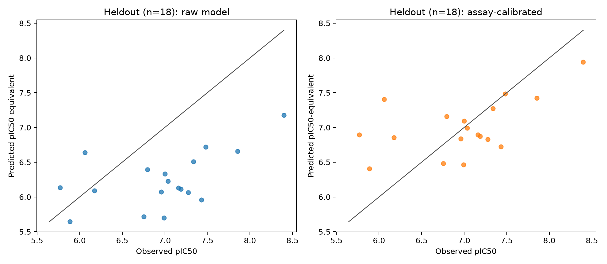

# ROCK2 external evaluation and calibration

2026-09-06 • Phase 18 • analyzed attempt 1

The frozen transfer/calibration gates did not jointly pass. This is a retrospective cross-publication evaluation of known compounds from Morwick et al. It does not establish that compounds are unseen during pretraining and does not support novelty, CEPT biology, ice inhibition, or prospective efficacy claims.

Boltz-2 version 2.2.1 ran all 30 compounds with fixed seeds 1801 and 1802. Each raw prediction is the arithmetic mean of the two pIC50-equivalent outputs, converted as `6 - affinity_pred_value` from the [documented log10(IC50 in µM) output](https://github.com/jwohlwend/boltz/blob/v2.2.1/docs/prediction.md). No best seed was selected.

## Metrics

| Evaluation | n | MAE | RMSE | Bias | Baseline MAE | Improvement | Spearman |
| --- | ---: | ---: | ---: | ---: | ---: | ---: | ---: |
| raw | 30 | 0.834 | 0.942 | -0.727 | 0.586 | -42.2% | 0.448 |
| source_calibrated | 30 | 0.650 | 0.741 | -0.436 | 0.586 | -10.9% | 0.448 |

### Held-out methods

| Method | n | MAE | RMSE | Bias | Calibration-mean MAE | Improvement | Spearman |
| --- | ---: | ---: | ---: | ---: | ---: | ---: | ---: |
| raw | 18 | 0.843 | 0.924 | -0.738 | 0.494 | -70.5% | 0.441 |
| source_calibrated | 18 | 0.645 | 0.714 | -0.446 | 0.494 | -30.4% | 0.441 |
| assay_calibrated | 18 | 0.433 | 0.558 | 0.026 | 0.494 | 12.4% | 0.441 |

All errors are in pIC50 units. Bias is mean(predicted minus observed); positive bias means predicted potency is too high. The full-panel baseline is the previous assay's frozen mean; the held-out baseline is the mean of the 12 calibration labels. These are different comparisons and their improvement percentages should not be directly compared.

Primary transfer gate: **FAIL**. Held-out calibration gate: **FAIL**.

Calibration subset: 12 compounds; held-out set: 18 compounds. Offset method: Add median(observed-predicted) on calibration subset only; fitted offset **0.764 pIC50**. The additive correction cannot improve Spearman by construction.

Calibration gate checks:

- `mae_at_most_limit`: pass
- `absolute_bias_at_most_limit`: pass
- `improvement_vs_calibration_mean`: fail
- `rank_correlation`: fail
- `no_worse_than_raw`: pass

Largest raw model-mean absolute error: **CHEMBL589359**, 1.751 pIC50. The largest calibrated held-out error is **CHEMBL605360**, 1.345 pIC50; no outlier was excluded.

On the held-out set, the diagnostic observed-on-calibrated-predicted slope is **0.908** and intercept is **0.617**; ideal values are 1 and 0. These test-set regression coefficients are descriptive and are not fitted into the deployed correction. The calibrated fraction within 0.5 pIC50 is **66.7%**.

Bootstrap intervals are paired scaffold-cluster resampling (14 clusters for all rows; the held-out set has 9 clusters). They are descriptive and conditional on the fitted offset; they exclude calibration-fit uncertainty and pretrained-data uncertainty. They must not be read as guaranteeing the point gate: a confidence interval crossing a 20% improvement threshold does not overturn or independently establish the frozen point-estimate decision.

- All 30 raw: MAE improvement 2.5th/median/97.5th percentiles **-164.2%, -44.6%, 10.0%**; Spearman **0.038, 0.462, 0.740**.
- Held-out assay-calibrated: MAE improvement **-54.0%, 11.5%, 50.8%**; Spearman **-0.124, 0.479, 0.935**.

The held-out calibrated improvement interval includes zero and negative values, so these data do not establish a robust improvement over the simple baseline.

The primary frozen transfer gate required at least 20% MAE improvement over the Phase 17 source mean and Spearman at least 0.5 across all 30 compounds. The calibration gate required held-out MAE ≤0.5 pIC50, absolute bias ≤0.25 pIC50, ≥20% improvement versus the 12-compound calibration mean, Spearman ≥0.5, and no worse held-out MAE than raw. It was evaluated only after an intercept-only median-residual fit on 12 calibration compounds. No cherry-picking, slope fitting, or best-method selection is permitted.

## Compound-level record

| Molecule | Split | Observed pIC50 | Raw model mean | Source-offset model | Assay-calibrated model | Seed difference |
| --- | --- | ---: | ---: | ---: | ---: | ---: |
| CHEMBL589102 | test | 6.796 | 6.395 | 6.687 | 7.159 | 0.267 |
| CHEMBL589117 | test | 5.770 | 6.132 | 6.424 | 6.896 | 0.240 |
| CHEMBL589118 | calibration | 7.051 | 5.759 | 6.050 | 6.523 | 0.256 |
| CHEMBL589359 | calibration | 7.745 | 5.994 | 6.285 | 6.758 | 0.239 |
| CHEMBL589827 | test | 5.886 | 5.645 | 5.936 | 6.409 | 0.385 |
| CHEMBL589844 | test | 6.959 | 6.072 | 6.363 | 6.836 | 0.336 |
| CHEMBL589845 | test | 7.187 | 6.110 | 6.402 | 6.875 | 0.095 |
| CHEMBL590322 | calibration | 7.137 | 6.026 | 6.318 | 6.791 | 0.579 |
| CHEMBL590810 | test | 7.854 | 6.656 | 6.947 | 7.420 | 0.444 |
| CHEMBL590811 | calibration | 7.187 | 6.169 | 6.461 | 6.934 | 0.707 |
| CHEMBL590826 | calibration | 7.155 | 6.952 | 7.243 | 7.716 | 0.179 |
| CHEMBL591058 | calibration | 8.000 | 6.410 | 6.701 | 7.174 | 0.163 |
| CHEMBL591116 | calibration | 8.097 | 7.329 | 7.620 | 8.093 | 0.013 |
| CHEMBL591355 | calibration | 7.131 | 6.943 | 7.235 | 7.708 | 0.561 |
| CHEMBL592709 | test | 7.036 | 6.226 | 6.517 | 6.990 | 0.736 |
| CHEMBL592715 | calibration | 5.495 | 5.795 | 6.086 | 6.559 | 0.097 |
| CHEMBL597126 | test | 7.000 | 6.330 | 6.621 | 7.094 | 0.110 |
| CHEMBL597127 | test | 7.276 | 6.066 | 6.357 | 6.830 | 0.402 |
| CHEMBL597734 | calibration | 6.164 | 6.517 | 6.808 | 7.281 | 0.191 |
| CHEMBL599791 | test | 7.337 | 6.509 | 6.800 | 7.273 | 0.422 |
| CHEMBL599792 | test | 7.161 | 6.132 | 6.423 | 6.896 | 0.864 |
| CHEMBL600852 | test | 8.398 | 7.177 | 7.469 | 7.941 | 0.490 |
| CHEMBL602238 | calibration | 5.796 | 5.036 | 5.327 | 5.800 | 0.035 |
| CHEMBL602437 | test | 6.174 | 6.089 | 6.380 | 6.853 | 0.187 |
| CHEMBL603162 | calibration | 6.620 | 6.112 | 6.403 | 6.876 | 0.395 |
| CHEMBL604085 | test | 6.754 | 5.717 | 6.008 | 6.481 | 0.034 |
| CHEMBL604087 | test | 7.481 | 6.720 | 7.011 | 7.484 | 0.046 |
| CHEMBL604789 | test | 6.991 | 5.698 | 5.989 | 6.462 | 0.084 |
| CHEMBL605360 | test | 6.060 | 6.641 | 6.933 | 7.405 | 0.424 |
| CHEMBL605401 | test | 7.432 | 5.957 | 6.249 | 6.722 | 0.474 |

## Validation status

All 60 predictions passed the archive, provenance and output checks; no validation errors.

Any validation error makes the primary and calibration conclusions inconclusive; no successful subset is selected. A failed calibration gate means this frozen setup does not qualify for screening, regardless of any descriptive raw or calibrated metric.

## Assay and provenance limits

The source is [CHEMBL1071707](https://www.ebi.ac.uk/chembl/api/data/assay/CHEMBL1071707.json), from the primary [Morwick et al. paper](https://doi.org/10.1021/jm9014263) and [ACS supporting information](https://acs.figshare.com/articles/journal_contribution/Hit_to_Lead_Account_of_the_Discovery_of_Bisbenzamide_and_Related_Ureidobenzamide_Inhibitors_of_Rho_Kinase/2796493). It measured ROCK2(1–543) inhibition using 750 nM ATP, 500 nM AKRRRLSSLRA peptide, 90 minutes at 28 °C, and a luciferase readout. The SI separately reports IMAP at 100 µM ATP. Luciferase detection-enzyme interference was reported for some dimethylaminomethylphenyl analogues, so absolute accuracy remains assay-sensitive. Phase 17 used CHEMBL4328667 with 100 µM ATP and residues 11–552; these are separate assay contexts. The model retains the Phase 17 542-residue sequence, 512-row MSA, and unforced partial 6ED6 template. Assay ATP, substrate and readout are not explicit physical inputs to the model. The source audit documents 17 unit corrections and exclusion of both ambiguous CHEMBL604249 rows. The frozen source mean is **7.287 pIC50** and source-only residual offset is **0.291 pIC50**.

All 30 rows are included in the frozen external dataset; the 12/18 calibration/test partition is scaffold-disjoint (5 calibration and 9 test scaffolds). No molecule ID, canonical isomeric structure or achiral structure matches Phase 17. Labels were accessible for source auditing, so this is not a blinded benchmark. Some source compounds are racemic or have unspecified stereochemistry; a predicted ligand structure does not explicitly model a racemic mixture. The known 2010 series may overlap pretraining. See [assay review](../data/phase18/assay-review.json), [source-table reconciliation](../data/phase18/source-table-reconciliation.json), and [external dataset](../data/phase18/external-dataset.json).

The [Boltz-2 paper](https://jeremywohlwend.com/assets/boltz2.pdf) names ChEMBL among its affinity-training sources. Its documented filters do not establish whether this particular assay or target was retained. The [training-overlap audit](../data/phase18/pretraining-overlap-review.json) therefore records exact membership as unknown; the structural PDB date cutoff does not establish affinity-data independence.

## Next step

Keep novel-candidate screening on hold. First test whether the error reflects limited compound ranking, an assay-dependent offset, or readout interference using a separate, preregistered dataset with orthogonal biochemical measurements. A new calibration model would need a fresh held-out test; do not tune on these 18 test compounds and then reuse them as validation.

## Reproduction and diagnostic figures

With the locally archived sources and result archive present, these commands verify and regenerate the analysis without renting compute. The raw files are excluded from Git; a fresh clone alone is insufficient.

```sh
.venv/bin/python -m unittest tests.test_analyze_rock_external tests.test_boltz_external_inference tests.test_runpod_boltz_external tests.test_reconcile_phase18
.venv/bin/python scripts/analyze_rock_external.py --attempt 1
.venv/bin/python scripts/plot_rock_external.py
python3 scripts/report_rock_external.py
```





## Compute and cleanup

Median absolute difference between the two seed predictions: **0.262 pIC50**. The executed plan was [external-plan](../data/phase18/external-plan-transport.json). Seed differences measure limited model stochasticity, not independent physical replicate uncertainty.

Reconciled records report **$0.7309** Phase 18 estimate, **$5.7750** all-phase estimate, **$5.7826** total reserve including pending intents, and **$5.7826** receipted reserve against the **$10.00** cap. All research Pods are recorded absent. These are estimates, not final invoices.

The [machine-readable result](../data/phase18/external-results.json) and [cost reconciliation](../data/phase18/compute-costs.json) preserve the frozen execution evidence. Any further experiment needs a new frozen plan and fresh cumulative billing reconciliation.
