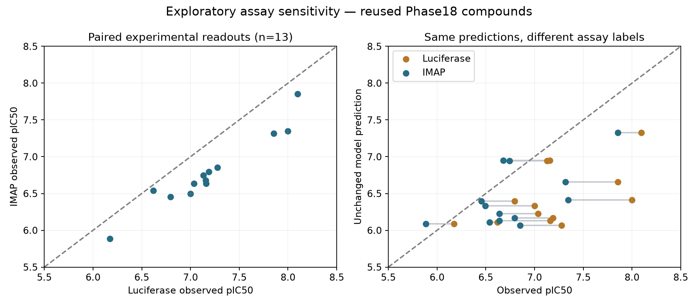

# ROCK2 assay sensitivity and independent-validation readiness

Phase 19, 6 September 2026. Novel-compound screening remains unqualified. We completed a paired-readout diagnostic using existing predictions and audited further experimental datasets. We have not completed a new independent model validation or fitted a new calibration. This phase incurred **$0 additional GPU cost**.

The earlier [Phase 18 evaluation](rock2-external-calibration.md) missed the frozen ranking and baseline-improvement criteria. This follow-up asks whether comparing the same predictions with a different experimental readout changes that interpretation, while separately seeking an eligible independent benchmark.

## What the paired comparison shows

Morwick et al. published both luciferase and IMAP fluorescence-polarization ROCK2 IC50 measurements for selected compounds. We visually checked the original supporting-information Table 1, pages S2–S3, transcribed all 18 rows, and joined the published compound numbers to our previously source-verified identities. Thirteen rows have exact measurements in both formats and existing validated predictions. Five remain excluded: entries 30, 31, 32 and 37 have censored endpoints; entry 33 has the previously unresolved database identity conflict. No censored bound was treated as an exact measurement. [Primary article](https://doi.org/10.1021/jm9014263), [official supporting information](https://ndownloader.figshare.com/files/4490860).

The predictions are unchanged two-seed means from Phase 18. The only corrected-output comparator uses the previously fixed Phase 17 offset of +0.291339 pIC50. We fitted no offset, slope, model or threshold to this diagnostic subset.

| Same 13 compounds | Luciferase labels | IMAP labels |
| --- | ---: | ---: |
| Raw model MAE, pIC50 | 0.744 | 0.445 |
| Raw mean signed error, predicted minus observed | −0.744 | −0.341 |
| Model rank correlation, Spearman | 0.423 | 0.457 |
| MAE with fixed Phase 17 offset | 0.514 | 0.343 |
| Signed error with fixed Phase 17 offset | −0.453 | −0.050 |

Across these 13 compounds, IMAP IC50 is a median **2.5 times higher** than luciferase IC50. The two experimental rankings agree closely (Spearman **0.955**). Thus changing the experimental labels substantially reduces absolute prediction error, while model ranking remains weak. These are descriptive comparisons on a small, author-selected subset, not evidence of a statistically established performance gain.



The comparison cannot identify the cause of the shift. IMAP uses 100 µM ATP, versus 0.75 µM for luciferase; substrate, timing and detection conditions also differ. The source authors selected this subset while investigating luciferase interference. These confounded changes prevent assigning the difference solely to interference or ATP competition. The model explicitly represents neither assay's detection chemistry or ATP concentration. [Source methods and comparison](https://ndownloader.figshare.com/files/4490860).

This is **reuse of previously evaluated compounds**, including prior test compounds, and is explicitly exploratory. It does not replace the failed Phase 18 qualification, provide a fresh held-out test, or establish prospective accuracy. No conclusion about post-thaw survival, physical cryoprotection or a novel protective compound follows.

## Independent dataset audit

Before new predictions, we recorded a [selection policy](../data/phase19/selection-policy.json): source-verified non-luciferase biochemical ROCK2 IC50, at least 20 unique eligible compounds, no identity or achiral-structure overlap with Phases 17/18, and a deterministic whole-scaffold calibration/test split. The split must contain at least six calibration compounds, ten test compounds and two test scaffolds. We did not search split seeds for a favorable outcome. Labels were accessible for source auditing, so this is not a blinded design.

| Candidate | Provisional exact measurements | Decision |
| --- | ---: | --- |
| Fang 2011, CHEMBL1686688 | 27 | No prior structural duplicates; 11 scaffolds; fixed split gives 15 calibration / 12 test. HTRF is a database annotation, but primary methods, actual assay species and structure-linked tables remain unverified. Not eligible yet. |
| Fang 2010, CHEMBL1219161 | 33 | No prior structural duplicates; seven scaffolds. Primary article unavailable, SI insufficient for assay verification, and the fixed scaffold split fails the minimum test size. |
| BAY-405 off-target panel, 2024 | Direct values not comprehensively transcribed; CSV contains selectivity ratios | Primary ROCK2 protocol uses ADP-Glo luciferase, so it fails the non-luciferase requirement. |
| N-acylhydrazone study, 2026 | 11 numbered compounds with quantitative ROCK2 IC50 | Primary radiometric readout verified, but too few observations and species/construct unspecified. Three reference controls do not bring it to 20. |

The 2011 candidate was checked through publisher, Europe PMC, OpenAlex, institutional metadata, BindingDB and the browser. The publisher presented a CAPTCHA in the browser; no full text was obtained. Repository/database records do not substitute for the original protocol and compound tables. The 2010 ACS supporting information was acquired, but contains analytical/chirality and kinase-panel material without the required main-paper ROCK2 measurements. CHEMBL1219161 itself only says “Inhibition of ROCK2”; its readout must not be inferred from CHEMBL1686688 or from a separate PubChem luminescence assay. [Fang 2011](https://doi.org/10.1016/j.bmcl.2011.01.039), [Fang 2010](https://doi.org/10.1021/jm100579r), [official ACS SI](https://acs.figshare.com/articles/journal_contribution/Tetrahydroisoquinoline_Derivatives_As_Highly_Selective_and_Potent_Rho_Kinase_Inhibitors/2743252).

The open 2026 study uses duplicate, ten-dose radiometric HotSpot measurements at 1 µM ATP. Its table contains 16 numbered study compounds: eleven quantitative ROCK2 IC50 values and five single-concentration inhibition percentages. Percent inhibition cannot be converted to IC50 here. We retained the article, table and SI as useful research evidence, without treating its small panel as the requested larger benchmark. Publication date alone does not prove absence from pretrained-model data. [Primary study](https://doi.org/10.1021/acsbiomedchemau.5c00246).

A broader check of the BAY-405 study found a documented human ROCK2 construct and an available compound CSV, but the ROCK2 protocol uses luciferase-based ADP-Glo at 10 µM ATP. We rejected it on readout before reconstructing any concentrations from rounded selectivity ratios. [Primary study](https://doi.org/10.1021/acs.jmedchem.4c01325).

## What is ready and what remains

The repository now includes reproducible paired-readout analysis, source/transcription hashes, explicit exclusions, independent-source audits, deterministic identity/split checks, and isolated Phase 19 preparation, inference, analysis and bounded cloud adapters. The cloud adapters are locally tested but **no Phase 19 scientific run plan, model inputs or GPU job has been frozen/launched**. Prior frozen experiments are preserved.

The immediate requirement for the planned independent validation is primary-source access and enough verified measurements—not another API or more GPU credit. The most direct route is an accessible copy of the Fang 2011 main article and its supporting information, followed by compound-by-compound reconciliation and confirmation of assay species/construct. An alternative dataset must meet the same scientific eligibility rules; we should not pool incompatible assays or relax the split after seeing model predictions.

Once an eligible dataset exists: freeze the audited identities, values, scaffold split and unchanged model settings; reconcile spending; run two predetermined seeds; evaluate raw transfer and calibration on the untouched test subset; report all outcomes against the existing gates. Novel screening should wait for that evidence. These biochemical checks still require separate cell and post-thaw experiments before any cryoprotection conclusion.

[Read-only compute reconciliation](../data/phase19/compute-costs.json) confirms all 26 prior research Pods absent, zero Phase 19 allocations and no pending reservation. Cumulative estimated GPU cost remains **$5.7750**; conservative reserve is **$5.7826**, leaving **$4.2174** under the user's $10 total cap. These are estimates/reserves rather than final invoices.

## Reproduction and evidence

```sh
.venv/bin/python -m scripts.audit_rock_orthogonal_candidates
.venv/bin/python scripts/analyze_rock_imap_diagnostic.py
.venv/bin/python -m unittest -q tests.test_rock_imap_diagnostic tests.test_prepare_rock_orthogonal tests.test_boltz_orthogonal_inference tests.test_analyze_rock_orthogonal tests.test_runpod_boltz_orthogonal tests.test_reconcile_phase19
```

Original downloads are ignored local research storage and must be restored for reproduction on another machine. Curated records, source hashes, scripts and figures are versioned.

- [All transcribed paired source rows and protocol context](../data/phase19/morwick-imap-source.json)
- [Joined diagnostic results, exclusions and metrics](../data/phase19/imap-diagnostic-results.json)
- [Provisional identity/scaffold audit](../data/phase19/candidate-identity-audit.json)
- [Fang 2011 source audit](../data/phase19/fang2011-acquisition-audit.json) and [additional access attempts](../data/phase19/fang2011-additional-acquisition.json)
- [Fang 2010 source audit](../data/phase19/alternative-assay-review.json)
- [Open radiometric study audit](../data/phase19/nacyl-audit.json)

- [BAY-405 off-target assay audit](../data/phase19/bay405-assay-review.json)
