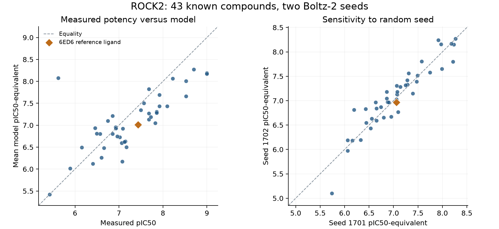

# ROCK2 Boltz panel benchmark

2026-09-06 • analyzed attempt 3

The frozen internal benchmark hypothesis was supported under the prespecified thresholds. The prespecified hypothesis required at least 20% MAE improvement over the preserved training-fold mean baseline and Spearman correlation at least 0.5 across all 43 exact compounds. This is retrospective evidence from one known medicinal-chemistry assay, not external validation, prospective generalization, or a biological efficacy claim.

## Primary result

| Evaluation | n | Model MAE (pIC50) | Mean baseline MAE | Nearest-neighbor MAE | Model improvement vs mean | Spearman |
| --- | ---: | ---: | ---: | ---: | ---: | ---: |
| Two-seed model mean | 43 | 0.439 | 0.683 | 0.844 | 35.8% | 0.744 |

The model prediction is the arithmetic mean of the two fixed seed outputs after conversion to pIC50-equivalent (`6 − affinity_pred_value`), following [Boltz’s documented output units](https://github.com/jwohlwend/boltz/blob/v2.2.1/docs/prediction.md); no best seed or post-hoc offset was selected. The nearest-neighbor column is descriptive context from the preserved baseline. The right-censored `>10 µM` compound is excluded from exact-value regression as frozen.

## Per-seed and stability results

Recorded invocation times: seed 1701: 33.1 minutes; seed 1702: 28.4 minutes. The first invocation includes reference-data and weight downloads; these are not pure GPU inference timings.

| Run | n | Model MAE | Mean baseline MAE | Nearest-neighbor MAE | Improvement | Spearman |
| --- | ---: | ---: | ---: | ---: | ---: | ---: |
| Seed 1701 | 43 | 0.467 | 0.683 | 0.844 | 31.7% | 0.729 |
| Seed 1702 | 43 | 0.438 | 0.683 | 0.844 | 35.9% | 0.732 |

Median absolute difference between the two seed predictions: **0.133 pIC50**.

Anchor-excluded sensitivity removes CHEMBL4522042, the compound linked to the 6ED6 structure. It is reported separately and does not change the frozen primary criterion:

| Evaluation | n | Model MAE (pIC50) | Mean baseline MAE | Nearest-neighbor MAE | Model improvement vs mean | Spearman |
| --- | ---: | ---: | ---: | ---: | ---: | ---: |
| 42-compound anchor-excluded | 42 | 0.439 | 0.696 | 0.864 | 36.9% | 0.736 |

The scaffold bootstrap resamples the 13 complete scaffold clusters with paired predictions and baseline values. Its percentile intervals are descriptive within this single series, not uncertainty intervals for external generalization:

- MAE improvement fraction, 2.5th / median / 97.5th percentiles: **0.064, 0.358, 0.432**.
- Spearman, 2.5th / median / 97.5th percentiles: **0.649, 0.744, 0.937**.

The 20% improvement criterion applies to the frozen point estimate. The descriptive improvement interval is 6.4%–43.2%. It includes values below 20%, so scaffold resampling does not robustly establish a margin of at least 20% even within this series.

The largest error was CHEMBL4575880: measured IC50 **2,400 nM** versus predicted IC50-equivalent **8.35 nM**, approximately **287-fold** apart. This compound remains in all applicable metrics; the error motivates further calibration and validation.

## Compound-level predictions

| Molecule | Observed pIC50 | Two-seed model mean | Nearest-neighbor baseline | Seed absolute difference |
| --- | ---: | ---: | ---: | ---: |
| CHEMBL1977135 | 6.921 | 6.954 | 7.432 | 0.181 |
| CHEMBL2006299 | 7.678 | 7.822 | 6.602 | 0.336 |
| CHEMBL4434688 | 9.000 | 8.192 | 6.569 | 0.086 |
| CHEMBL4436040 | 7.060 | 6.593 | 6.602 | 0.077 |
| CHEMBL4436197 | 7.495 | 7.348 | 6.745 | 0.136 |
| CHEMBL4438453 | 7.018 | 6.726 | 6.155 | 0.141 |
| CHEMBL4445356 | 7.076 | 6.172 | 7.167 | 0.024 |
| CHEMBL4446212 | 6.658 | 6.484 | 7.167 | 0.101 |
| CHEMBL4447521 | 5.420 | 5.420 | 7.432 | 0.637 |
| CHEMBL4448806 | 8.699 | 8.269 | 6.155 | 0.000 |
| CHEMBL4451899 | 6.854 | 6.806 | 6.155 | 0.126 |
| CHEMBL4454552 | 6.959 | 6.745 | 6.602 | 0.191 |
| CHEMBL4459077 | 8.097 | 7.431 | 6.745 | 0.082 |
| CHEMBL4459800 | 7.854 | 7.307 | 6.155 | 0.045 |
| CHEMBL4460511 | 7.569 | 7.502 | 8.699 | 0.026 |
| CHEMBL4463301 | 7.469 | 7.020 | 7.432 | 0.321 |
| CHEMBL4465725 | 7.854 | 7.281 | 6.495 | 0.073 |
| CHEMBL4469316 | 8.222 | 8.064 | 8.523 | 0.189 |
| CHEMBL4469434 | 7.824 | 7.046 | 7.569 | 0.030 |
| CHEMBL4471862 | 6.745 | 7.100 | 6.456 | 0.061 |
| CHEMBL4472858 | 9.000 | 8.174 | 7.569 | 0.012 |
| CHEMBL4474946 | 7.921 | 7.689 | 6.155 | 0.232 |
| CHEMBL4475535 | 5.886 | 6.017 | 6.602 | 0.092 |
| CHEMBL4476761 | 6.928 | 6.931 | 6.602 | 0.325 |
| CHEMBL4521871 | 7.086 | 6.924 | 6.745 | 0.093 |
| CHEMBL4522042 | 7.432 | 7.013 | 7.469 | 0.095 |
| CHEMBL4536833 | 8.523 | 8.008 | 6.602 | 0.418 |
| CHEMBL4547725 | 6.569 | 6.802 | 7.721 | 0.330 |
| CHEMBL4550282 | 6.495 | 6.812 | 7.854 | 0.283 |
| CHEMBL4553926 | 7.921 | 7.434 | 7.143 | 0.251 |
| CHEMBL4555093 | 7.678 | 7.131 | 7.143 | 0.104 |
| CHEMBL4556370 | 7.167 | 6.503 | 7.076 | 0.619 |
| CHEMBL4557041 | 7.721 | 7.185 | 6.569 | 0.238 |
| CHEMBL4568447 | 6.409 | 6.125 | 7.167 | 0.128 |
| CHEMBL4570150 | 6.602 | 6.261 | 6.928 | 0.133 |
| CHEMBL4572198 | 7.678 | 7.271 | 7.143 | 0.244 |
| CHEMBL4575880 | 5.620 | 8.078 | 6.155 | 0.324 |
| CHEMBL4577208 | 6.854 | 7.210 | 6.745 | 0.143 |
| CHEMBL4583341 | 8.523 | 7.661 | 8.222 | 0.169 |
| CHEMBL4584824 | 6.155 | 6.495 | 8.699 | 0.102 |
| CHEMBL4585481 | 7.143 | 6.631 | 7.678 | 0.397 |
| CHEMBL4588929 | 7.125 | 6.620 | 7.167 | 0.062 |
| CHEMBL4590232 | 6.456 | 6.935 | 6.745 | 0.065 |

## Validation status

All 86 predictions passed archive, provenance and output checks; no validation errors.

If validation errors are present, the scientific conclusion is **inconclusive** and no successful subset is selected. A `not_supported_internal_benchmark` verdict means the complete archived panel ran and the prespecified thresholds were not met; it is evidence against this frozen hypothesis under this setup, not evidence that Boltz cannot predict ROCK2 activity generally.

## Assay and structural scope

The measured labels retain [ChEMBL attribution and CC BY-SA 3.0 provenance](../data/phase15/rock-benchmark.json). The 43 exact labels come from CHEMBL4328667, a single ROCK2 enzyme assay associated with [Hobson et al.](https://doi.org/10.1021/acs.jmedchem.8b01098). The source audit independently maps 11 Table 1 compounds; 32 remaining labels retain their same-assay ChEMBL provenance without a claimed article compound-number mapping. CHEMBL4328667 assays GST-fused human ROCK2 residues 11–552. The routine potency assay used 100 µM ATP, 0.2 µM STK S2 peptide and 0.5 nM ROCK2 for 60 minutes, followed by HTRF detection. The initial discovery screen used radiometric 33P; the routine HTRF procedure is specified separately in the [supporting information](https://acs.figshare.com/articles/journal_contribution/Identification_of_Selective_Dual_ROCK1_and_ROCK2_Inhibitors_Using_Structure-Based_Drug_Design/7458515).

The model uses the corresponding 542-residue human sequence without the GST fusion, a 512-row MSA, and an unforced partial 6ED6 protein template. ATP, peptide and the experimental assay conditions are not explicit physical inputs to inference. The deposited template sequence includes the ROCK2 residues 27–417 core plus an N-terminal purification tag; this sequence audit does not assert that every residue has resolved coordinates. These construct differences limit correspondence between the model and the experimental assay.

The medicinal-chemistry series, its structure-linked ligand, and pretrained model data may overlap. The preserved baseline uses scaffold-grouped folds; Boltz itself is pretrained and is not refit within those folds, so the split cannot establish independence from model pretraining. Predictions are enzyme IC50 model outputs, not Kd, cell activity, ice inhibition, CPA permeability, CEPT mixture efficacy, post-thaw viability, or evidence of a new compound.

## Next scientific gate

After the complete panel result, the next gate is a preregistered evaluation on an independent ROCK2 assay dataset with construct and endpoint metadata, plus calibration analysis on held-out measurements. The [candidate external-assay inventory](../data/phase17/external-benchmark-candidates.json) identifies separate publications, but these older data may also overlap model training; new measurements or a training-overlap audit remain necessary for an unseen-data claim. Any further GPU run needs its own frozen evaluation and a fresh reconciliation under the existing $10 cumulative limit. These affinity results do not establish CEPT effects or biological efficacy.



## Compute and cleanup

| Phase 17 attempt | Outcome | Estimated GPU cost | Pod deletion |
| --- | --- | ---: | --- |
| 1 | rejected before allocation | $0.0000 | Not applicable |
| 2 | rejected before allocation | $0.0000 | Not applicable |
| 3 | complete | $0.8066 | Confirmed |

Reconciled cost records report **$0.8066** for Phase 17, **$5.0441** cumulative estimated GPU spending, **$5.0463** conservative cumulative reserve, and **$5.0463** receipted reserve against the **$10.00** cumulative cap. All research Pods are recorded absent. Attempts 1 and 2 were rejected before allocation; attempt 3 used an RTX 4090 at $0.74/hour with a hard three-hour deadline and a $2.70 maximum reservation. Actual estimated charges are derived from its receipt, rather than equated with that reservation.

The [machine-readable panel result](../data/phase17/panel-results.json), [executed frozen panel plan](../data/phase17/panel-plan-4090.json), [assay review](../data/phase17/assay-review.json), and [source-table audit](../data/phase17/source-table-audit.json) preserve provenance. The report generator reads those recorded artifacts and does not recompute or invent predictions.

## Reproduction

With the archived inputs and result bundle retained under the ignored local research storage, these commands verify and regenerate the analysis without renting a GPU. A fresh clone alone does not contain the raw archive.

```sh
.venv/bin/python -m unittest tests.test_analyze_rock_panel tests.test_boltz_panel_inference tests.test_runpod_boltz_panel tests.test_reconcile_phase17
.venv/bin/python scripts/analyze_rock_panel.py --attempt 3
.venv/bin/python scripts/plot_rock_panel.py
python3 scripts/report_rock_panel.py
```
