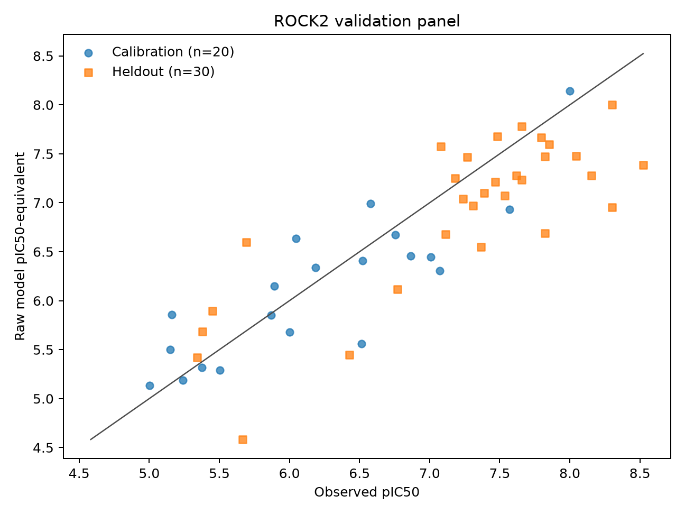
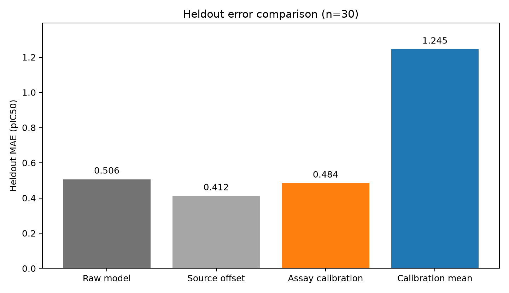
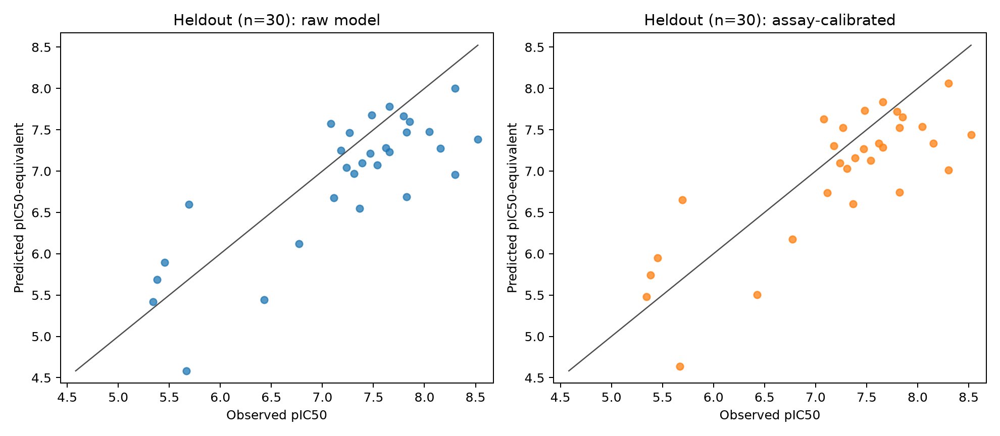

# ROCK2 validation evaluation and calibration

2026-09-07 • Phase 20 • analyzed attempt 1

The frozen transfer/calibration gates did not jointly pass. This is a retrospective validation of a known 2019 chromen series in an orthogonal ROCK2 assay. It does not establish that compounds are unseen during pretraining and does not support novelty, cryoprotection, cell function, or prospective efficacy claims.

Boltz-2 version 2.2.1 ran all 50 compounds with fixed seeds 2001 and 2002. Each raw prediction is the arithmetic mean of the two pIC50-equivalent outputs, converted as `6 - affinity_pred_value` from the [documented log10(IC50 in µM) output](https://github.com/jwohlwend/boltz/blob/v2.2.1/docs/prediction.md). No best seed was selected.

Raw transfer passed on all 50 compounds, while the held-out calibration missed only the absolute-bias check by 0.013 pIC50. This is a small threshold miss, not evidence of a sharp scientific boundary. The frozen joint decision remains unqualified.

## Metrics

| Evaluation | n | MAE | RMSE | Bias | Baseline MAE | Improvement | Spearman |
| --- | ---: | ---: | ---: | ---: | ---: | ---: | ---: |
| raw | 50 | 0.442 | 0.553 | -0.220 | 0.864 | 48.8% | 0.864 |
| source_calibrated | 50 | 0.411 | 0.512 | 0.071 | 0.864 | 52.5% | 0.864 |

### Held-out methods

| Method | n | MAE | RMSE | Bias | Calibration-mean MAE | Improvement | Spearman |
| --- | ---: | ---: | ---: | ---: | ---: | ---: | ---: |
| raw | 30 | 0.506 | 0.619 | -0.319 | 1.245 | 59.3% | 0.681 |
| source_calibrated | 30 | 0.412 | 0.531 | -0.028 | 1.245 | 66.9% | 0.681 |
| assay_calibrated | 30 | 0.484 | 0.591 | -0.263 | 1.245 | 61.1% | 0.681 |

All errors are in pIC50 units. Bias is mean(predicted minus observed); positive bias means predicted potency is too high. The full-panel baseline is the previous assay's frozen mean; the held-out baseline is the mean of the 20 calibration labels. These are different comparisons and their improvement percentages should not be directly compared.

Primary transfer gate: **PASS**. Held-out calibration gate: **FAIL**.

Calibration subset: 20 compounds; held-out set: 30 compounds. Offset method: Add median(observed-predicted) on calibration subset only; fitted offset **0.056 pIC50**. The additive correction cannot improve Spearman by construction.

Calibration gate checks:

- `mae_at_most_limit`: pass
- `absolute_bias_at_most_limit`: fail
- `improvement_vs_calibration_mean`: pass
- `rank_correlation`: pass
- `no_worse_than_raw`: pass

The fixed scaffold partition also shifted the observed potency distribution: calibration mean 6.216, held-out mean 7.224 pIC50. This helps explain why the calibration-mean baseline is weak on the test set; large percentage improvements must be read alongside absolute error and ranking. It does not isolate the cause of residual bias. The source-only offset performs better here, but choosing it after inspecting test results cannot replace the prespecified assay-calibration gate.

Largest raw model-mean absolute error: **CHEMBL4562184**, 1.346 pIC50. The largest calibrated held-out error is **CHEMBL4562184**, 1.290 pIC50; no outlier was excluded.

On the held-out set, the diagnostic observed-on-calibrated-predicted slope is **0.895** and intercept is **0.997**; ideal values are 1 and 0. These test-set regression coefficients are descriptive and are not fitted into the deployed correction. The calibrated fraction within 0.5 pIC50 is **63.3%**.

Bootstrap intervals are paired scaffold-cluster resampling (14 clusters for all rows; the held-out set has only 3 clusters). They are descriptive and conditional on the fitted offset; they exclude calibration-fit uncertainty and pretrained-data uncertainty. They must not be read as guaranteeing the point gate: a confidence interval crossing a 20% improvement threshold does not overturn or independently establish the frozen point-estimate decision.

- All 50 raw: MAE improvement 2.5th/median/97.5th percentiles **31.7%, 50.1%, 76.4%**; Spearman **0.751, 0.852, 0.929**.
- Held-out assay-calibrated: MAE improvement **60.1%, 61.1%, 80.0%**; Spearman **0.000, 0.681, 0.736**.

Held-out Spearman was defined in 1831 of 2000 bootstrap draws; undefined draws were omitted from its displayed percentiles. With only three test scaffolds, these intervals have limited resolution.


## Across-phase descriptive comparison

| Phase | n | Raw MAE | Raw Spearman | Assay context | Recorded verdict |
| --- | ---: | ---: | ---: | --- | --- |
| Phase 17 | 43 | 0.439 | 0.744 | HTRF; 100 µM ATP; human ROCK2 11–552 | supported_internal_benchmark |
| Phase 18 | 30 | 0.834 | 0.448 | luciferase; 750 nM ATP; human ROCK2 1–543 | novel_screening_not_qualified |
| Phase 20 | 50 | 0.442 | 0.864 | radiometric; 10 µM ATP; current provider protocol; 2019 lot uncertain | novel_screening_not_qualified |

These rows are descriptive only. Baselines differ across phases, and compound series, ATP, construct, readout, and lot are confounded; the table does not support pooled gains or causal attribution to readout. Interpret each phase under its frozen decision rules.

The primary frozen transfer gate required at least 20% MAE improvement over the Phase 17 source mean and Spearman at least 0.5 across all 50 compounds. The calibration gate required held-out MAE ≤0.5 pIC50, absolute bias ≤0.25 pIC50, ≥20% improvement versus the 20-compound calibration mean, Spearman ≥0.5, and no worse held-out MAE than raw. It was evaluated only after an intercept-only median-residual fit on 20 calibration compounds. No cherry-picking, slope fitting, or best-method selection is permitted.

## Compound-level record

| Molecule | Split | Observed pIC50 | Raw model mean | Source-offset model | Assay-calibrated model | Seed difference |
| --- | --- | ---: | ---: | ---: | ---: | ---: |
| CHEMBL4437283 | test | 7.387 | 7.101 | 7.392 | 7.157 | 0.123 |
| CHEMBL4438748 | test | 8.523 | 7.385 | 7.676 | 7.441 | 0.277 |
| CHEMBL4440876 | test | 7.237 | 7.041 | 7.333 | 7.098 | 0.297 |
| CHEMBL4444449 | calibration | 6.000 | 5.679 | 5.970 | 5.735 | 0.217 |
| CHEMBL4444893 | calibration | 5.162 | 5.860 | 6.151 | 5.916 | 0.088 |
| CHEMBL4445974 | calibration | 8.000 | 8.143 | 8.434 | 8.199 | 0.021 |
| CHEMBL4446390 | test | 8.155 | 7.277 | 7.569 | 7.333 | 0.477 |
| CHEMBL4447770 | calibration | 7.009 | 6.446 | 6.738 | 6.502 | 0.049 |
| CHEMBL4451007 | test | 8.301 | 8.004 | 8.295 | 8.060 | 0.723 |
| CHEMBL4451407 | test | 7.310 | 6.973 | 7.264 | 7.029 | 0.576 |
| CHEMBL4452238 | test | 6.427 | 5.445 | 5.737 | 5.501 | 0.165 |
| CHEMBL4452457 | calibration | 6.754 | 6.672 | 6.963 | 6.728 | 0.129 |
| CHEMBL4453948 | test | 7.824 | 7.471 | 7.762 | 7.527 | 0.522 |
| CHEMBL4454066 | test | 5.453 | 5.893 | 6.184 | 5.949 | 0.144 |
| CHEMBL4455163 | calibration | 7.569 | 6.932 | 7.223 | 6.988 | 0.432 |
| CHEMBL4457201 | test | 7.658 | 7.781 | 8.072 | 7.837 | 0.098 |
| CHEMBL4458667 | test | 7.620 | 7.279 | 7.570 | 7.335 | 0.808 |
| CHEMBL4458703 | test | 5.381 | 5.686 | 5.977 | 5.742 | 0.011 |
| CHEMBL4459655 | test | 7.658 | 7.233 | 7.525 | 7.289 | 0.342 |
| CHEMBL4460696 | calibration | 6.186 | 6.339 | 6.630 | 6.395 | 0.186 |
| CHEMBL4467086 | calibration | 6.046 | 6.635 | 6.926 | 6.691 | 0.096 |
| CHEMBL4467403 | test | 7.824 | 6.690 | 6.982 | 6.747 | 0.062 |
| CHEMBL4470778 | test | 7.481 | 7.678 | 7.969 | 7.734 | 0.131 |
| CHEMBL4472964 | test | 7.180 | 7.248 | 7.540 | 7.304 | 0.006 |
| CHEMBL4473009 | calibration | 6.866 | 6.457 | 6.748 | 6.513 | 0.081 |
| CHEMBL4474271 | calibration | 6.580 | 6.990 | 7.281 | 7.046 | 0.411 |
| CHEMBL4474804 | calibration | 5.892 | 6.151 | 6.442 | 6.207 | 0.220 |
| CHEMBL4475590 | calibration | 5.149 | 5.501 | 5.793 | 5.558 | 0.151 |
| CHEMBL4475912 | test | 7.081 | 7.576 | 7.867 | 7.632 | 0.205 |
| CHEMBL4476081 | calibration | 5.001 | 5.134 | 5.425 | 5.190 | 0.187 |
| CHEMBL4476505 | test | 8.046 | 7.479 | 7.770 | 7.535 | 0.346 |
| CHEMBL4514074 | calibration | 5.871 | 5.851 | 6.142 | 5.907 | 0.005 |
| CHEMBL4519471 | test | 7.367 | 6.547 | 6.838 | 6.603 | 0.727 |
| CHEMBL4526491 | calibration | 6.520 | 6.407 | 6.698 | 6.463 | 0.092 |
| CHEMBL4529033 | test | 5.693 | 6.598 | 6.889 | 6.654 | 0.133 |
| CHEMBL4533805 | test | 7.538 | 7.075 | 7.366 | 7.131 | 0.092 |
| CHEMBL4539818 | calibration | 6.514 | 5.559 | 5.850 | 5.615 | 0.671 |
| CHEMBL4551100 | test | 6.772 | 6.118 | 6.409 | 6.174 | 0.269 |
| CHEMBL4555946 | test | 7.114 | 6.678 | 6.970 | 6.735 | 0.137 |
| CHEMBL4556104 | test | 7.469 | 7.212 | 7.503 | 7.268 | 0.578 |
| CHEMBL4558371 | calibration | 7.071 | 6.308 | 6.599 | 6.364 | 0.931 |
| CHEMBL4562184 | test | 8.301 | 6.955 | 7.246 | 7.011 | 0.359 |
| CHEMBL4568022 | test | 5.668 | 4.583 | 4.874 | 4.639 | 0.607 |
| CHEMBL4576394 | test | 7.854 | 7.596 | 7.887 | 7.652 | 0.030 |
| CHEMBL4577999 | calibration | 5.503 | 5.290 | 5.582 | 5.347 | 0.126 |
| CHEMBL4581933 | test | 5.341 | 5.422 | 5.713 | 5.478 | 0.101 |
| CHEMBL4585524 | calibration | 5.241 | 5.190 | 5.481 | 5.246 | 0.403 |
| CHEMBL4586795 | test | 7.796 | 7.664 | 7.956 | 7.720 | 0.052 |
| CHEMBL4586827 | test | 7.268 | 7.467 | 7.758 | 7.523 | 0.071 |
| CHEMBL4590957 | calibration | 5.376 | 5.315 | 5.606 | 5.371 | 0.410 |

## Validation status

All 100 expected predictions passed the archive, provenance and output checks; no validation errors.

Any validation error makes the primary and calibration conclusions inconclusive; no successful subset is selected. A failed calibration gate means this frozen setup does not qualify for screening, regardless of any descriptive raw or calibrated metric.

## Assay and provenance limits

The source search inventoried 763 ChEMBL ROCK2 assays and retrieved 54 literature assays whose descriptions contained non-luciferase method keywords. These database annotations were screening leads, not verified protocols. The 2019 chromen source was selected because its author-supplied CSV allowed complete structure and potency reconciliation, supported by published assay details and provider documentation. The 2013 urea paper was also acquired but still required manual structure reconciliation. No new model outputs were used in source selection. See the [source inventory](../data/phase20/orthogonal-source-inventory.json) and [identity/split audit](../data/phase20/inventory-identity-audit.json).

The source is the primary [2019 J. Med. Chem. article](https://doi.org/10.1021/acs.jmedchem.9b01143), its [official supporting information](https://ndownloader.figshare.com/files/19066013), and the [supporting-data CSV](https://ndownloader.figshare.com/files/19066016). The audited source table contains 57 records: 50 exact labels and 7 censored records; the frozen validation split contains 20 calibration and 30 test compounds across 14 scaffolds. The [current Eurofins protocol](https://www.eurofinsdiscovery.com/catalog/rock2-human-agc-kinase-enzymatic-radiometric-10-um-atp-leadhunter-fr/14-451KP10) corroborates the historical method, but cannot certify the identity of the historical 2019 reagent lot, so this comparison does not establish current-lot reproducibility. The model retains the Phase 17 542-residue sequence, 512-row MSA, and unforced partial 6ED6 template; assay ATP, substrate, readout, and lot are not explicit physical inputs. The frozen source mean is **7.287 pIC50** and source-only residual offset is **0.291 pIC50**.

All 50 exact rows are included in the frozen validation dataset; the 20/30 calibration/test partition is scaffold-disjoint across 14 total scaffolds, with 11 calibration scaffolds but only 3 held-out scaffolds (group sizes 27, 2 and 1). Thus 27 of the 30 test compounds share one scaffold, and confidence intervals reflect limited independent structural diversity despite 30 test compounds. Seven censored records remain excluded from exact-label scoring. No molecule ID, canonical isomeric structure or achiral structure matches Phase 17 or Phase 18. Labels were accessible for source auditing, so this is not a blinded benchmark. Pretraining independence is unknown, and this assay cannot support claims about cryoprotection, cell function, or biological efficacy. See [2019 source audit](../data/phase20/rock2-2019-source-audit.json), [source-table reconciliation](../data/phase20/source-table-reconciliation.json), and [validation dataset](../data/phase20/validation-dataset.json).

The [Boltz-2 paper](https://jeremywohlwend.com/assets/boltz2.pdf) names ChEMBL among its affinity-training sources. Its documented filters do not establish whether this particular assay or target was retained. The prior phase overlap review records exact membership as unknown; no pretraining independence claim is made.

## Next step

Keep novel screening unqualified under the frozen joint gate. The useful next study is a prespecified calibration-transfer evaluation with broader independent scaffold coverage and an assay-matched reference set. The raw ranking signal justifies testing that question; this small bias miss does not justify changing the threshold or selecting the better source offset after seeing test results. Any revised calibration or model must be frozen and evaluated on fresh held-out data. Preserve the weaker Phase 18 result and make no efficacy claim from these retrospective assays.

See the [decision rules recorded before results](../docs/rock2-validation-decision-rules.md).

## Reproduction and diagnostic figures

With the locally archived sources and result archive present, these commands verify and regenerate the analysis without renting compute. The raw files are excluded from Git; a fresh clone alone is insufficient.

```sh
.venv/bin/python -m unittest tests.test_analyze_rock_validation tests.test_boltz_validation_inference tests.test_runpod_boltz_validation tests.test_reconcile_phase20
.venv/bin/python scripts/analyze_rock_validation.py --attempt 1
.venv/bin/python scripts/plot_rock_validation.py
python3 scripts/report_rock_validation.py
```





## Compute and cleanup

Median absolute difference between the two seed predictions: **0.176 pIC50**. The executed plan was [validation-plan](../data/phase20/validation-plan.json). Seed differences measure limited model stochasticity, not independent physical replicate uncertainty.

Reconciled records report **$0.9763** Phase 20 estimate, **$6.7513** all-phase estimate, **$6.7637** total reserve including pending intents, and **$6.7637** receipted reserve against the **$10.00** cap. All research Pods are recorded absent. These are estimates, not final invoices.

The [machine-readable result](../data/phase20/validation-results.json), [independent metric review](../data/phase20/independent-results-review.json), and [cost reconciliation](../data/phase20/compute-costs.json) preserve the frozen execution evidence. Any further experiment needs a new frozen plan and fresh cumulative billing reconciliation.
